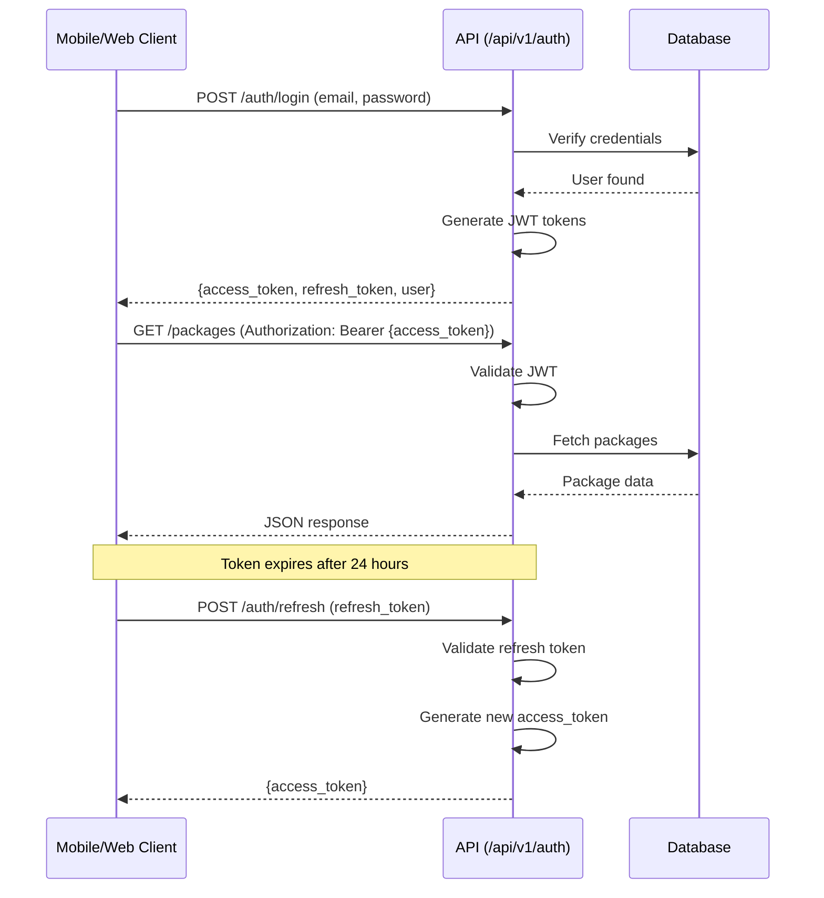

# Authentication & Authorization

## JWT Token-Based Authentication

**Purpose**: Stateless authentication for mobile/web API clients

**Flow**:



## Authentication Guards

**Configuration**: `config/auth.php`

```php
'guards' => [
    'web' => [
        'driver' => 'session',
        'provider' => 'users',
    ],

    'api' => [
        'driver' => 'jwt',
        'provider' => 'users',  // Customer API
    ],

    'admin' => [
        'driver' => 'jwt',
        'provider' => 'admins',
    ],

    'vendor' => [
        'driver' => 'jwt',
        'provider' => 'vendors',
    ],
],

'providers' => [
    'users' => [
        'driver' => 'eloquent',
        'model' => App\Models\User::class,
    ],

    'admins' => [
        'driver' => 'eloquent',
        'model' => App\Models\Admin::class,
    ],

    'vendors' => [
        'driver' => 'eloquent',
        'model' => App\Models\Vendor::class,
    ],
],
```

## Middleware Protection

**Route Protection**:
```php
// Customer API routes (PACK, CCW)
Route::middleware('auth:api')->group(function () {
    Route::get('/profile', [ProfileController::class, 'show']);
    Route::post('/cart', [CartController::class, 'store']);
    Route::post('/orders', [OrderController::class, 'store']);
});

// Admin routes (CAD)
Route::middleware('auth:admin')->group(function () {
    Route::get('/dashboard', [DashboardController::class, 'index']);
    Route::post('/vendors/approve/{id}', [VendorController::class, 'approve']);
});

// Vendor routes (CAR)
Route::middleware('auth:vendor')->group(function () {
    Route::get('/orders', [VendorOrderController::class, 'index']);
    Route::post('/packages', [VendorPackageController::class, 'store']);
});
```

## Role-Based Access Control (RBAC)

**Roles**:
- **Customer** (User model) - Can order, customize packages, manage subscriptions
- **Vendor** (Vendor model) - Can manage menu, fulfill orders, view analytics
- **Admin** (Admin model) - Can manage platform, approve vendors, resolve disputes

**Permission Levels** (Admin):
```php
// app/Models/Admin.php
const ROLES = [
    'super_admin' => 'Full platform access',
    'admin' => 'Standard admin access',
    'moderator' => 'Content moderation only',
];

public function hasPermission($permission)
{
    return in_array($permission, $this->permissions ?? []);
}
```

---
