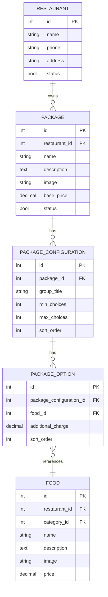

# Package System Architecture (CPFP)

## Overview

The **Package & Combos system** is CurryDash's key differentiator. It implements a **flexible meal package customization** system where:

- Restaurants create **packages** (e.g., "Family Curry Pack")
- Each package has **configuration groups** (e.g., "Choose protein", "Select spice level")
- Each configuration has **min/max choice** validation
- Customers select **options** from each configuration
- Options can have **additional charges**

**Jira Project**: CPFP (Food Packages and Combos)

## Data Model



## Model Relationships

### Package Model (`app/Models/Package.php`)

```php
class Package extends Model
{
    protected $fillable = [
        'restaurant_id', 'name', 'description', 'image', 'images', 'base_price', 'status',
    ];

    protected $casts = [
        'images' => 'array', // Multiple images
    ];

    protected $appends = ['image_full_url'];

    /**
     * Package belongs to Restaurant
     */
    public function restaurant()
    {
        return $this->belongsTo(Restaurant::class);
    }

    /**
     * Package has many Configuration groups
     */
    public function configurations()
    {
        return $this->hasMany(PackageConfiguration::class)->orderBy('sort_order');
    }

    /**
     * Scope: Only active packages
     */
    public function scopeActive($query)
    {
        return $query->where('status', true);
    }

    /**
     * Accessor: Full image URL
     */
    public function getImageFullUrlAttribute()
    {
        return Helpers::get_full_url('package', $this->image, 'public');
    }
}
```

### PackageConfiguration Model

```php
class PackageConfiguration extends Model
{
    protected $fillable = [
        'package_id', 'group_title', 'min_choices', 'max_choices', 'sort_order',
    ];

    /**
     * Configuration belongs to Package
     */
    public function package()
    {
        return $this->belongsTo(Package::class);
    }

    /**
     * Configuration has many Options
     */
    public function options()
    {
        return $this->hasMany(PackageOption::class)->orderBy('sort_order');
    }
}
```

### PackageOption Model

```php
class PackageOption extends Model
{
    protected $fillable = [
        'package_configuration_id', 'food_id', 'additional_charge', 'sort_order',
    ];

    /**
     * Option belongs to Configuration
     */
    public function configuration()
    {
        return $this->belongsTo(PackageConfiguration::class, 'package_configuration_id');
    }

    /**
     * Option references Food item
     */
    public function food()
    {
        return $this->belongsTo(Food::class, 'food_id');
    }
}
```

## Package Customization Flow

**Step 1**: Customer views package

**API**: `GET /api/v1/packages/{id}`

**Response**:
```json
{
  "id": 1,
  "restaurant_id": 5,
  "name": "Family Curry Pack",
  "description": "Perfect for 4 people",
  "base_price": 45.00,
  "configurations": [
    {
      "id": 1,
      "group_title": "Choose your protein (Select 2-3)",
      "min_choices": 2,
      "max_choices": 3,
      "options": [
        {
          "id": 1,
          "food_id": 10,
          "food_name": "Chicken Curry",
          "additional_charge": 0.00
        },
        {
          "id": 2,
          "food_id": 11,
          "food_name": "Lamb Curry",
          "additional_charge": 5.00
        },
        {
          "id": 3,
          "food_id": 12,
          "food_name": "Seafood Curry",
          "additional_charge": 7.00
        }
      ]
    },
    {
      "id": 2,
      "group_title": "Select spice level (Choose 1)",
      "min_choices": 1,
      "max_choices": 1,
      "options": [
        {
          "id": 4,
          "food_id": 20,
          "food_name": "Mild",
          "additional_charge": 0.00
        },
        {
          "id": 5,
          "food_id": 21,
          "food_name": "Medium",
          "additional_charge": 0.00
        },
        {
          "id": 6,
          "food_id": 22,
          "food_name": "Hot",
          "additional_charge": 0.00
        }
      ]
    }
  ]
}
```

**Step 2**: Customer customizes package

**Frontend**: Flutter package customization screen (PACK project)

**Validation**: Mobile app validates min/max choices before allowing "Add to Cart"

**Step 3**: Add to cart

**API**: `POST /api/v1/cart/package`

**Request**:
```json
{
  "package_id": 1,
  "quantity": 1,
  "selected_options": [
    {"option_id": 1},  // Chicken Curry
    {"option_id": 2},  // Lamb Curry (+$5)
    {"option_id": 5}   // Medium spice
  ]
}
```

**Backend Validation**:
- Check min/max choices for each configuration
- Calculate total price: base_price + sum(additional_charges)
- Validate all selected options belong to the package

**See**: [Business Logic](business-logic.md) for validation implementation

---
