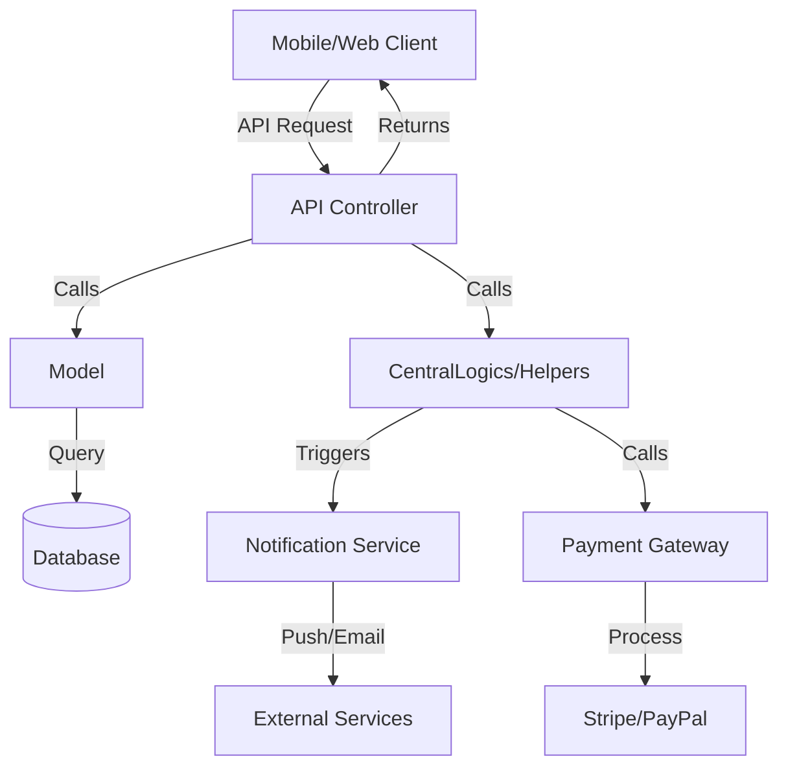
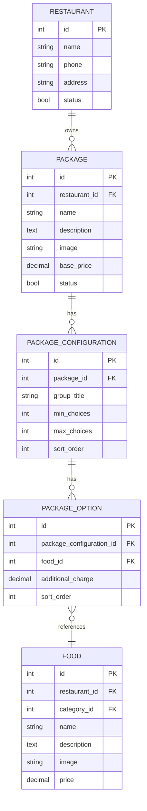
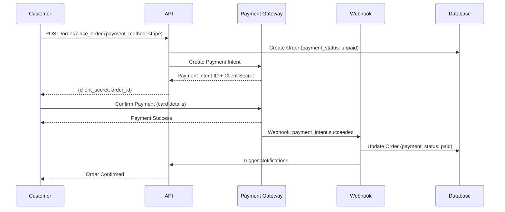
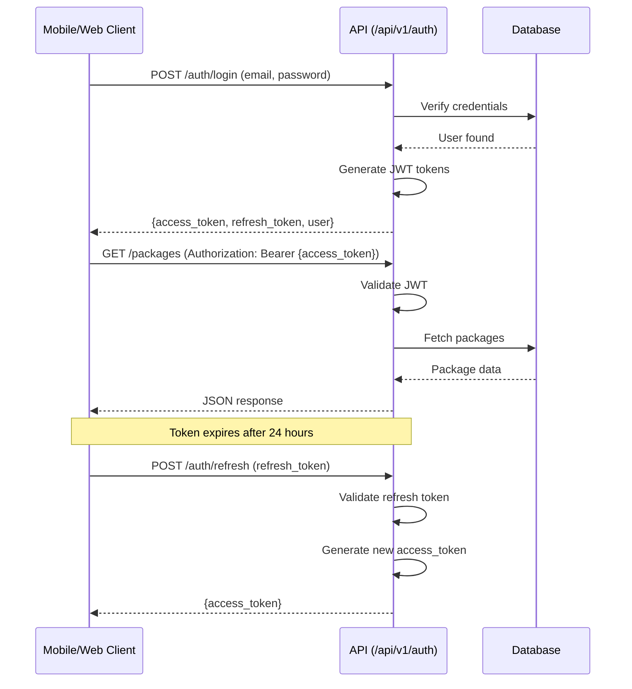

# Overview

The CurryDash backend is built on **Laravel 9.x** with a **modular architecture** pattern. It serves as the central hub coordinating:

- **Admin Dashboard** (CAD Jira project)
- **Vendor Dashboard** (CAR Jira project)
- **Customer Mobile/Web Apps** (PACK & CCW Jira projects)
- **Central Orchestration** (CUR Jira project)
- **Package System** (CPFP Jira project)

## Key Architecture Principles

1. **Modular Design**: Laravel Modules (nWidart) for feature encapsulation
2. **Service-Oriented**: Business logic in service layers, not controllers
3. **Eloquent ORM**: Database abstraction with model relationships
4. **RESTful APIs**: JSON API endpoints for mobile/web clients
5. **JWT Authentication**: Token-based stateless authentication
6. **Central Orchestration**: CentralLogics layer coordinates cross-project concerns

## Technology Stack

| Component | Technology | Purpose |
|-----------|-----------|---------|
| **Framework** | Laravel 9.x | PHP web application framework |
| **Language** | PHP 8.1+ | Server-side scripting |
| **Database** | MySQL 8.0 | Relational data storage |
| **Cache** | Redis | Session, cache, queue storage |
| **Queue** | Laravel Queues | Background job processing |
| **Storage** | Local / S3 | File storage (images, documents) |
| **Modules** | nWidart/laravel-modules | Modular architecture |

## Related Documentation

📚 **Cross-Project References**:
- **Mobile/Web Architecture**: [User-Web-Mobile/docs/architecture.md](https://github.com/CoralShades/User-Web-Mobile/blob/main/docs/architecture.md) - Flutter feature-first clean architecture
- **API Reference (Client)**: [User-Web-Mobile/docs/api-reference.md](https://github.com/CoralShades/User-Web-Mobile/blob/main/docs/api-reference.md) - 100+ endpoints from mobile perspective
- **API Specification (Server)**: [api-specification.md](api-specification.md) - Backend endpoint implementation details
- **Database Schema**: [database-schema.md](database-schema.md) - ERD and table specifications

---
# Laravel Project Structure

## Top-Level Directory Structure

```
Admin-Seller_Portal/
├── app/                          # Application core
│   ├── CentralLogics/            # ✨ CUR orchestration layer (custom)
│   ├── Console/                  # Artisan commands
│   ├── Exceptions/               # Exception handlers
│   ├── Http/                     # Controllers, middleware, requests
│   │   ├── Controllers/
│   │   │   ├── Admin/            # CAD project controllers
│   │   │   ├── Api/V1/           # API controllers (mobile/web)
│   │   │   └── Vendor/           # CAR project controllers
│   │   ├── Middleware/           # Request middleware
│   │   └── Requests/             # Form request validation
│   ├── Library/                  # Third-party integrations
│   ├── Mail/                     # Email templates (Mailable classes)
│   ├── Models/                   # Eloquent models
│   ├── Observers/                # Model observers (events)
│   ├── Providers/                # Service providers
│   ├── Rules/                    # Custom validation rules
│   ├── Scopes/                   # Query scopes
│   ├── Traits/                   # Reusable traits
│   └── helpers.php               # Global helper functions
├── bootstrap/                    # Framework bootstrap
├── config/                       # Configuration files
│   ├── auth.php                  # Authentication guards
│   ├── database.php              # Database connections
│   ├── mail.php                  # Email configuration
│   └── ...
├── database/                     # Database files
│   ├── factories/                # Model factories (testing/seeding)
│   ├── migrations/               # Database migrations
│   └── seeders/                  # Database seeders
├── docs/                         # ✨ Project documentation (BMAD)
│   ├── sprint-artifacts/         # Sprint tracking
│   ├── index.md                  # Documentation hub
│   ├── architecture.md           # This file
│   └── ...
├── Modules/                      # ✨ Modular architecture (nWidart)
│   ├── TaxModule/                # Tax calculation module
│   └── ...                       # Other feature modules
├── public/                       # Publicly accessible files
│   ├── index.php                 # Entry point
│   └── storage/                  # Symlink to storage/app/public
├── resources/                    # Views, assets
│   ├── views/                    # Blade templates
│   │   ├── admin-views/          # CAD dashboard views
│   │   ├── vendor-views/         # CAR dashboard views
│   │   └── layouts/              # Shared layouts
│   └── lang/                     # Localization files
├── routes/                       # Route definitions
│   ├── api/                      # API routes
│   │   ├── v1/                   # API version 1
│   │   │   └── api.php           # Main API routes
│   │   └── v2/                   # API version 2 (future)
│   ├── admin.php                 # Admin dashboard routes (CAD)
│   ├── vendor.php                # Vendor dashboard routes (CAR)
│   ├── web.php                   # Web routes (landing pages)
│   └── channels.php              # Broadcast channels
├── storage/                      # Application storage
│   ├── app/                      # Application files
│   ├── framework/                # Framework files
│   └── logs/                     # Application logs
├── tests/                        # PHPUnit tests
│   ├── Feature/                  # Feature tests
│   └── Unit/                     # Unit tests
├── vendor/                       # Composer dependencies
├── .env                          # Environment configuration
├── artisan                       # Artisan CLI
├── composer.json                 # PHP dependencies
└── package.json                  # Node dependencies
```

## Key Directories Explained

### `app/CentralLogics/` (CUR Orchestration)

Custom directory for **cross-project orchestration** logic:

**Purpose**: Central utilities shared across CAD, CAR, PACK, CCW, CPFP projects

**Key Files**:
- `Helpers.php` - Static utility methods (error formatting, payment helpers, notification triggers, settings retrieval, image URL generation)
- `OrderLogic.php` - Order lifecycle orchestration
- `RestaurantLogic.php` - Restaurant/vendor business logic

**Usage Pattern**:
```php
use App\CentralLogics\Helpers;

// Error formatting
$errors = Helpers::error_processor($validator);

// Get business setting
$scheduleOrderEnabled = Helpers::schedule_order();

// Generate full image URL
$imageUrl = Helpers::get_full_url('package', $imageName, 'public');
```

**Jira Mapping**: CUR project (Central management)

### `app/Http/Controllers/`

Controllers organized by **user role** and **API version**:

**Admin Controllers** (`Admin/`):
- `DashboardController.php` - Admin analytics dashboard
- `VendorController.php` - Vendor management (approval, suspension)
- `PackageController.php` - Package approval/moderation
- `OrderController.php` - Order monitoring and dispute resolution
- `ReportController.php` - Platform reporting
- **Jira**: CAD project

**Vendor Controllers** (`Vendor/`):
- `ProfileController.php` - Vendor profile management
- `PackageController.php` - Package CRUD operations
- `OrderController.php` - Order fulfillment
- `ReportController.php` - Vendor analytics
- **Jira**: CAR project

**API Controllers** (`Api/V1/`):
- `AuthController.php` - Customer authentication
- `PackageController.php` - Package listing and customization
- `RestaurantController.php` - Restaurant discovery
- `OrderController.php` - Order placement and tracking
- `SubscriptionController.php` - Subscription management
- **Jira**: CUR project (serves PACK and CCW frontends)

**Pattern**:
```php
class PackageController extends Controller
{
    public function index(Request $request)
    {
        // 1. Validate request
        $validator = Validator::make($request->all(), [
            'restaurant_id' => 'required|exists:restaurants,id',
        ]);

        if ($validator->fails()) {
            return response()->json(['errors' => Helpers::error_processor($validator)], 403);
        }

        // 2. Retrieve data via Eloquent
        $packages = Package::where('restaurant_id', $request->restaurant_id)
            ->where('status', true)
            ->with(['configurations.options.food'])
            ->get();

        // 3. Return JSON response
        return response()->json($packages, 200);
    }
}
```

### `app/Models/`

Eloquent models representing database tables:

**User Management**:
- `User.php` - Customer accounts
- `Admin.php` - Admin accounts
- `Vendor.php` - Vendor accounts (restaurant owners)

**Restaurant & Menu**:
- `Restaurant.php` - Restaurant profiles
- `Category.php` - Food categories
- `Food.php` - Individual menu items
- `AddOn.php` - Add-on items

**Package System** (CPFP):
- `Package.php` - Meal packages/combos
- `PackageConfiguration.php` - Configuration groups
- `PackageOption.php` - Selectable options

**Orders & Commerce**:
- `Order.php` - Order records
- `OrderDetail.php` - Order line items
- `Cart.php` - Shopping cart
- `Subscription.php` - Recurring deliveries

**See**: [Database Schema](database-schema.md) for full ERD

### `Modules/` (Modular Architecture)

Laravel Modules (nWidart) for feature encapsulation:

**Current Modules**:
- `TaxModule/` - Tax calculation logic
- *(Additional modules can be added)*

**Module Structure** (Standard):
```
Modules/TaxModule/
├── Config/
├── Console/
├── Database/
│   ├── Migrations/
│   └── Seeders/
├── Entities/            # Models
├── Http/
│   ├── Controllers/
│   └── Requests/
├── Providers/
│   ├── TaxModuleServiceProvider.php
│   └── RouteServiceProvider.php
├── Resources/
│   ├── assets/
│   └── views/
├── Routes/
│   ├── api.php
│   └── web.php
├── Tests/
├── composer.json
└── module.json
```

**Benefits**:
- Independent feature development
- Clear module boundaries
- Reusable across projects
- Can be enabled/disabled via `modules_statuses.json`

---
# Design Patterns

## Model-View-Controller (MVC)

Laravel's default pattern:

```
Request → Route → Controller → Model → Database
                      ↓
                    View (Blade template for admin/vendor dashboards)
                      OR
                    JSON (for API endpoints)
```

## Controller → Model Pattern (Simplified)

**Used in**: Simple CRUD operations

**Example**: Package listing
```php
// Route
Route::get('/packages', [PackageController::class, 'index']);

// Controller (app/Http/Controllers/Api/V1/PackageController.php)
public function index(Request $request)
{
    $packages = Package::where('restaurant_id', $request->restaurant_id)
        ->with(['configurations.options.food'])
        ->get();

    return response()->json($packages);
}

// Model (app/Models/Package.php)
class Package extends Model
{
    public function configurations()
    {
        return $this->hasMany(PackageConfiguration::class)->orderBy('sort_order');
    }
}
```

## Repository Pattern (Emerging)

**Status**: Not fully implemented, but recommended for complex queries

**When to Use**: Complex business logic, multiple data sources, testability

**Example Structure** (if implemented):
```php
// Interface
interface PackageRepositoryInterface
{
    public function findByRestaurant($restaurantId);
    public function createWithConfigurations(array $data);
}

// Implementation
class PackageRepository implements PackageRepositoryInterface
{
    public function findByRestaurant($restaurantId)
    {
        return Package::where('restaurant_id', $restaurantId)
            ->with(['configurations.options.food'])
            ->get();
    }
}

// Controller
class PackageController extends Controller
{
    protected $packageRepo;

    public function __construct(PackageRepositoryInterface $packageRepo)
    {
        $this->packageRepo = $packageRepo;
    }

    public function index(Request $request)
    {
        $packages = $this->packageRepo->findByRestaurant($request->restaurant_id);
        return response()->json($packages);
    }
}
```

**Registration** (in `app/Providers/AppServiceProvider.php`):
```php
public function register()
{
    $this->app->bind(
        PackageRepositoryInterface::class,
        PackageRepository::class
    );
}
```

## Observer Pattern

**Purpose**: Respond to model events (creating, created, updating, updated, deleting, deleted)

**Example**: `app/Observers/OrderObserver.php`
```php
class OrderObserver
{
    public function created(Order $order)
    {
        // Send notification to vendor
        // Log order creation
        // Update restaurant statistics
    }

    public function updated(Order $order)
    {
        // Notify customer of status change
        // Log status history
    }
}
```

**Registration** (in `app/Providers/EventServiceProvider.php`):
```php
public function boot()
{
    Order::observe(OrderObserver::class);
}
```

---
# Modular Architecture

## Laravel Modules (nWidart)

**Package**: `nwidart/laravel-modules`

**Purpose**: Organize large applications into self-contained modules

**Module Status** (`modules_statuses.json`):
```json
{
    "TaxModule": true,
    "PaymentModule": true,
    "NotificationModule": false
}
```

## Creating a New Module

```bash
# Generate module scaffold
php artisan module:make ModuleName

# Generate controller within module
php artisan module:make-controller ControllerName ModuleName

# Generate model within module
php artisan module:make-model ModelName ModuleName

# Generate migration within module
php artisan module:make-migration create_table_name ModuleName
```

## Module Best Practices

1. **Single Responsibility**: Each module handles one business capability
2. **Self-Contained**: Module should work independently
3. **Clear Interfaces**: Define contracts for inter-module communication
4. **Avoid Direct Dependencies**: Use service providers and dependency injection

---
# CentralLogics Orchestration Layer (CUR)

## Purpose

The **CentralLogics** directory (`app/CentralLogics/`) serves as the **Central orchestration layer** for the CurryDash platform. It contains:

- Cross-project utility functions
- Business logic shared between CAD, CAR, PACK, CCW, CPFP
- Payment processing helpers
- Notification triggers
- Settings management

**Jira Project**: CUR (CurryPackApp Central Management)

## Key Files

### `Helpers.php`

**Purpose**: Static utility methods used throughout the application

**Key Methods**:

| Method | Purpose | Used By |
|--------|---------|---------|
| `error_processor($validator)` | Format validation errors for API | All controllers |
| `schedule_order()` | Check if scheduled orders enabled | Order controllers |
| `variation_price($product, $variations)` | Calculate variation price | Cart, Order |
| `get_full_url($type, $filename, $storage)` | Generate full image URL | Models (Package, Food, Restaurant) |
| `send_push_notif_to_device($fcm_token, $data)` | Send push notification | Order status changes |
| `send_push_notif_to_topic($data, $topic)` | Broadcast to topic | Admin announcements |

**Example Usage**:
```php
use App\CentralLogics\Helpers;

// In Controller
if ($validator->fails()) {
    return response()->json([
        'errors' => Helpers::error_processor($validator)
    ], 403);
}

// In Model Accessor
public function getImageFullUrlAttribute()
{
    return Helpers::get_full_url('package', $this->image, 'public');
}
```

### `OrderLogic.php`

**Purpose**: Order lifecycle orchestration

**Responsibilities**:
- Order creation workflow
- Order status transitions
- Payment processing coordination
- Notification triggers (customer, vendor, delivery)
- Order assignment to delivery personnel

### `RestaurantLogic.php`

**Purpose**: Restaurant/vendor business logic

**Responsibilities**:
- Vendor registration approval
- Restaurant availability calculation
- Zone/delivery area validation
- Vendor analytics aggregation

## CUR Orchestration Patterns



**See**: [Integration Architecture](integration-architecture.md) for detailed CUR patterns

---
# Package System Architecture (CPFP)

## Overview

The **Package & Combos system** is CurryDash's key differentiator. It implements a **flexible meal package customization** system where:

- Restaurants create **packages** (e.g., "Family Curry Pack")
- Each package has **configuration groups** (e.g., "Choose protein", "Select spice level")
- Each configuration has **min/max choice** validation
- Customers select **options** from each configuration
- Options can have **additional charges**

**Jira Project**: CPFP (Food Packages and Combos)

## Data Model



## Model Relationships

### Package Model (`app/Models/Package.php`)

```php
class Package extends Model
{
    protected $fillable = [
        'restaurant_id', 'name', 'description', 'image', 'images', 'base_price', 'status',
    ];

    protected $casts = [
        'images' => 'array', // Multiple images
    ];

    protected $appends = ['image_full_url'];

    /**
     * Package belongs to Restaurant
     */
    public function restaurant()
    {
        return $this->belongsTo(Restaurant::class);
    }

    /**
     * Package has many Configuration groups
     */
    public function configurations()
    {
        return $this->hasMany(PackageConfiguration::class)->orderBy('sort_order');
    }

    /**
     * Scope: Only active packages
     */
    public function scopeActive($query)
    {
        return $query->where('status', true);
    }

    /**
     * Accessor: Full image URL
     */
    public function getImageFullUrlAttribute()
    {
        return Helpers::get_full_url('package', $this->image, 'public');
    }
}
```

### PackageConfiguration Model

```php
class PackageConfiguration extends Model
{
    protected $fillable = [
        'package_id', 'group_title', 'min_choices', 'max_choices', 'sort_order',
    ];

    /**
     * Configuration belongs to Package
     */
    public function package()
    {
        return $this->belongsTo(Package::class);
    }

    /**
     * Configuration has many Options
     */
    public function options()
    {
        return $this->hasMany(PackageOption::class)->orderBy('sort_order');
    }
}
```

### PackageOption Model

```php
class PackageOption extends Model
{
    protected $fillable = [
        'package_configuration_id', 'food_id', 'additional_charge', 'sort_order',
    ];

    /**
     * Option belongs to Configuration
     */
    public function configuration()
    {
        return $this->belongsTo(PackageConfiguration::class, 'package_configuration_id');
    }

    /**
     * Option references Food item
     */
    public function food()
    {
        return $this->belongsTo(Food::class, 'food_id');
    }
}
```

## Package Customization Flow

**Step 1**: Customer views package

**API**: `GET /api/v1/packages/{id}`

**Response**:
```json
{
  "id": 1,
  "restaurant_id": 5,
  "name": "Family Curry Pack",
  "description": "Perfect for 4 people",
  "base_price": 45.00,
  "configurations": [
    {
      "id": 1,
      "group_title": "Choose your protein (Select 2-3)",
      "min_choices": 2,
      "max_choices": 3,
      "options": [
        {
          "id": 1,
          "food_id": 10,
          "food_name": "Chicken Curry",
          "additional_charge": 0.00
        },
        {
          "id": 2,
          "food_id": 11,
          "food_name": "Lamb Curry",
          "additional_charge": 5.00
        },
        {
          "id": 3,
          "food_id": 12,
          "food_name": "Seafood Curry",
          "additional_charge": 7.00
        }
      ]
    },
    {
      "id": 2,
      "group_title": "Select spice level (Choose 1)",
      "min_choices": 1,
      "max_choices": 1,
      "options": [
        {
          "id": 4,
          "food_id": 20,
          "food_name": "Mild",
          "additional_charge": 0.00
        },
        {
          "id": 5,
          "food_id": 21,
          "food_name": "Medium",
          "additional_charge": 0.00
        },
        {
          "id": 6,
          "food_id": 22,
          "food_name": "Hot",
          "additional_charge": 0.00
        }
      ]
    }
  ]
}
```

**Step 2**: Customer customizes package

**Frontend**: Flutter package customization screen (PACK project)

**Validation**: Mobile app validates min/max choices before allowing "Add to Cart"

**Step 3**: Add to cart

**API**: `POST /api/v1/cart/package`

**Request**:
```json
{
  "package_id": 1,
  "quantity": 1,
  "selected_options": [
    {"option_id": 1},  // Chicken Curry
    {"option_id": 2},  // Lamb Curry (+$5)
    {"option_id": 5}   // Medium spice
  ]
}
```

**Backend Validation**:
- Check min/max choices for each configuration
- Calculate total price: base_price + sum(additional_charges)
- Validate all selected options belong to the package

**See**: [Business Logic](business-logic.md) for validation implementation

---
# Subscription System Architecture

## Overview

The CurryDash subscription system supports **two types** of subscriptions:

1. **Restaurant Subscriptions** - Platform fees for vendors/sellers (subscription vs commission business model)
2. **Customer Subscriptions** - Recurring delivery subscriptions for customers (HelloFresh-style meal subscriptions)

**Jira Projects**: CUR-114 (lifecycle), CAR-004 (vendor billing), CPFP-15 (data model)

## Restaurant Subscription Model

**Purpose**: Manage vendor platform access via subscription plans

**Models** (3 core models):
```
SubscriptionPackage (Master Plan Template)
├── id, package_name, price, validity (days)
├── Features: chat, review, pos, mobile_app, self_delivery
├── max_order, max_product (usage limits)
├── is_trial boolean
└── HasMany: RestaurantSubscription, SubscriptionTransaction

RestaurantSubscription (Active Subscription per Restaurant)
├── id, restaurant_id, package_id
├── expiry_date, price, validity
├── Features: chat, review, pos, mobile_app, self_delivery
├── max_order, max_product
├── is_canceled, canceled_by
├── HasOne: SubscriptionTransaction (latest)
└── HasMany: SubscriptionTransaction

SubscriptionTransaction (Financial Records)
├── id, restaurant_id, package_id, restaurant_subscription_id
├── paid_amount, payment_method, status
├── is_trial, validity
├── created_by (admin/vendor)
└── BelongsTo: Restaurant, SubscriptionPackage
```

**Business Model Toggle**:
```php
// Restaurant model
restaurant_model enum:
├── 'commission' - Pay % per order
└── 'subscription' - Pay monthly/yearly subscription fee

// When subscription model:
if (restaurant->restaurant_model === 'subscription') {
    // Check active subscription
    $active_subscription = $restaurant->restaurant_subscription()
        ->where('expiry_date', '>', now())
        ->where('is_canceled', false)
        ->first();

    if (!$active_subscription) {
        // Restrict vendor access
    }
}
```

## Customer Subscription Model

**Purpose**: Recurring meal delivery for customers

**Models** (4 core models):
```
Subscription (User/Customer-based subscriptions)
├── id, user_id, restaurant_id, quantity
├── billing_amount, paid_amount, status
├── start_at, end_at
├── delivery_preference_time
├── pause, pause_start_date, pause_end_date, pause_count
├── HasMany: SubscriptionSchedule, SubscriptionLog, SubscriptionPause
└── Computed: is_paused_today, dynamic_status (active/paused/expired)

SubscriptionSchedule (Delivery Schedules)
├── id, subscription_id
├── day (0-6 for days of week, or specific date)
├── type enum: 'daily', 'weekly', 'monthly'
└── BelongsTo: Subscription

SubscriptionPause (Pause Periods)
├── id, subscription_id
├── from (date), to (date)
├── Scope: CheckDate
└── BelongsTo: Subscription

SubscriptionLog (Order Tracking)
├── id, subscription_id, order_id, delivery_man_id
├── order_status tracking
└── BelongsTo: Subscription, Order, DeliveryMan

SubscriptionBillingAndRefundHistory (Audit Trail)
├── id, subscription_id
├── transaction_type, transaction_amount
├── created_by (admin/vendor)
└── Financial audit trail
```

## Subscription Scheduling Logic

**Daily Subscription**:
```php
// Create order every day
SubscriptionSchedule::create([
    'subscription_id' => $subscription->id,
    'type' => 'daily',
]);

// Cron job (daily):
$active_subs = Subscription::where('status', 'active')
    ->whereHas('schedules', fn($q) => $q->where('type', 'daily'))
    ->whereDate('start_at', '<=', now())
    ->whereDate('end_at', '>=', now())
    ->whereDoesntHave('pauses', fn($q) => $q->whereDate('from', '<=', now())->whereDate('to', '>=', now()))
    ->get();

foreach ($active_subs as $sub) {
    // Create order for today
    createSubscriptionOrder($sub);
}
```

**Weekly Subscription**:
```php
// Deliver on specific days (e.g., Monday, Wednesday, Friday)
SubscriptionSchedule::create(['subscription_id' => $id, 'type' => 'weekly', 'day' => 1]); // Monday
SubscriptionSchedule::create(['subscription_id' => $id, 'type' => 'weekly', 'day' => 3]); // Wednesday
SubscriptionSchedule::create(['subscription_id' => $id, 'type' => 'weekly', 'day' => 5]); // Friday

// Cron job:
$today_day = now()->dayOfWeek; // 0-6
$weekly_subs = Subscription::where('status', 'active')
    ->whereHas('schedules', fn($q) => $q->where('type', 'weekly')->where('day', $today_day))
    ->whereNot('is_paused_today')
    ->get();
```

**Monthly Subscription**:
```php
// Deliver on specific date each month (e.g., 1st and 15th)
SubscriptionSchedule::create(['subscription_id' => $id, 'type' => 'monthly', 'day' => 1]);
SubscriptionSchedule::create(['subscription_id' => $id, 'type' => 'monthly', 'day' => 15]);

// Cron job:
$today_date = now()->day;
$monthly_subs = Subscription::where('status', 'active')
    ->whereHas('schedules', fn($q) => $q->where('type', 'monthly')->where('day', $today_date))
    ->get();
```

## Pause Functionality

```php
// Pause subscription (vacation mode)
SubscriptionPause::create([
    'subscription_id' => $subscription->id,
    'from' => '2025-12-20',
    'to' => '2026-01-05',
]);

// Model scope
public function getIsPausedTodayAttribute()
{
    return $this->pauses()
        ->whereDate('from', '<=', now())
        ->whereDate('to', '>=', now())
        ->exists();
}

// Dynamic status
public function getDynamicStatusAttribute()
{
    if ($this->is_paused_today) return 'paused';
    if ($this->end_at < now()) return 'expired';
    if ($this->status === 'active') return 'active';
    return $this->status;
}
```

---
# Order System Architecture

## Overview

The CurryDash order system is feature-rich with **99 columns** in the orders table, supporting:

- Multi-item orders (food + packages simultaneously)
- Package customization tracking
- Subscription-linked orders
- Multiple payment methods
- Guest checkout
- Order proof images
- Delivery tips
- Tax calculations (TaxModule integration)

**Database Stats:**
- **orders** table: 99 columns (created May 2021, 50+ enhancements)
- **order_details** table: 24 columns (line items, package-aware)
- **order_package_selections** table: 5 columns (package option tracking)

## Order Models

```
Order (99 columns - comprehensive)
├── user_id (FK), restaurant_id (FK), delivery_man_id (FK)
├── order_amount, coupon_discount_amount, delivery_charge
├── total_tax_amount, restaurant_discount_amount, admin_discount_amount
├── order_status enum: pending, confirmed, processing, out_for_delivery, delivered, canceled, etc.
├── payment_method enum: cash_on_delivery, digital_payment, wallet, offline_payment
├── payment_status enum: unpaid, paid, failed, refunded
├── subscription_id (links to subscription orders)
├── zone_id, distance
├── dm_tips, cutlery, is_guest
├── additional_charge, extra_packaging_amount, ref_bonus_amount
├── order_proof (JSON array of proof images)
├── scheduled (boolean), delivery_date, delivery_time
├── HasMany: OrderDetail, OrderPayment, OrderDeliveryHistory
├── HasOne: OrderReference, CashBackHistory
└── BelongsTo: User/Guest, Restaurant, DeliveryMan, Subscription, Zone

OrderDetail (24 columns - Line items)
├── order_id, food_id, package_id, item_campaign_id
├── is_package boolean (distinguishes package vs food orders)
├── quantity, price, discount_on_food
├── total_add_on_price, add_ons (JSON array)
├── variation (JSON), tax_amount, tax_status
├── created_at, updated_at
├── HasMany: OrderPackageSelection (when is_package=true)
└── BelongsTo: Food, Order, Package, ItemCampaign

OrderPackageSelection (5 columns - Package customization audit)
├── id, order_detail_id, package_option_id, food_id
├── price, quantity
└── BelongsTo: OrderDetail, PackageOption, Food

Cart (11 columns - Pre-order shopping cart)
├── user_id, item_id, package_id, is_guest
├── item_type (polymorphic: Food or ItemCampaign)
├── price, quantity
├── add_on_ids (array), add_on_qtys (array)
├── variation (JSON for food variations)
├── options (JSON - stores package selections before checkout)
└── BelongsTo: Package
```

## Order Placement Flow

**Step 1: Cart to Order Conversion**

Handled by `app/Traits/PlaceNewOrder.php` (900+ lines):

```php
trait PlaceNewOrder {
    private function makeOrderDetails($cart_item, $order_id)
    {
        if ($cart_item->is_package) {
            // Package order
            $package = Package::find($cart_item->package_id);

            $order_detail = OrderDetail::create([
                'order_id' => $order_id,
                'package_id' => $cart_item->package_id,
                'is_package' => true,
                'quantity' => $cart_item->quantity,
                'price' => $package->base_price,
            ]);

            // Create package selections
            foreach ($cart_item->options as $option_id) {
                $option = PackageOption::find($option_id);
                OrderPackageSelection::create([
                    'order_detail_id' => $order_detail->id,
                    'package_option_id' => $option->id,
                    'food_id' => $option->food_id,
                    'price' => $option->additional_charge,
                    'quantity' => 1,
                ]);
            }
        } else {
            // Regular food order
            $food = Food::find($cart_item->item_id);

            OrderDetail::create([
                'order_id' => $order_id,
                'food_id' => $cart_item->item_id,
                'is_package' => false,
                'quantity' => $cart_item->quantity,
                'price' => $this->calculate_variation_price($food, $cart_item->variation),
                'add_ons' => $cart_item->add_on_ids,
                'total_add_on_price' => $this->calculate_addon_price($cart_item->add_on_ids),
                'variation' => $cart_item->variation,
            ]);
        }
    }

    private function calculate_variation_price($variations, $quantity) { ... }
    private function calculate_addon_price($addons, $quantity) { ... }
    private function apply_discount($price, $discount) { ... }
    private function calculate_tax($price, $tax_rate) { ... }
}
```

**Step 2: Financial Settlement**

Handled by `app/CentralLogics/order.php`:

```php
class OrderLogic {
    public static function create_transaction($order_id, $order_amount, $restaurant_amount)
    {
        // Calculate commission
        $commission = $order_amount * (config('commission_rate') / 100);
        $vendor_payment = $restaurant_amount - $commission;

        // Record transaction
        Transaction::create([
            'order_id' => $order_id,
            'vendor_id' => $order->restaurant->vendor_id,
            'order_amount' => $order_amount,
            'restaurant_amount' => $restaurant_amount,
            'admin_commission' => $commission,
            'restaurant_discount' => $order->restaurant_discount_amount,
            'admin_discount' => $order->admin_discount_amount,
            'free_delivery' => $order->free_delivery_by_admin,
            'vendor_payable' => $vendor_payment,
        ]);
    }

    public static function cashbackToWallet($order) { ... }
    public static function expense_calculation($order) { ... }
}
```

## Order Status State Machine

```php
// Order status flow
pending → confirmed → processing → out_for_delivery → delivered
                                  ↓
                               canceled (at any stage)
                                  ↓
                               refunded (if payment processed)

// Validation:
- Cannot cancel after out_for_delivery (vendor decision)
- Cannot mark delivered without delivery_man_id (if platform delivery)
- Cannot process payment twice
```

---
# Restaurant System Architecture

## Overview

The Restaurant system supports **dual business models**:

1. **Commission Model** - Platform earns % per order
2. **Subscription Model** - Vendor pays monthly/yearly subscription fee

**Restaurant Model** (68 columns - heavily evolved):

```
Restaurant
├── id, vendor_id, zone_id, cuisine_id
├── name, logo, cover_photo
├── minimum_order, delivery_charge, tax
├── restaurant_model enum: 'commission', 'subscription'
├── package_id (default package for orders)
├── order_subscription_active boolean (enables customer subscriptions)
├── POS, self_delivery_system, delivery flags
├── opening_time, closing_time, off_day (schedule)
├── veg, non_veg, cutlery (dietary flags)
├── schedule_order (advanced scheduling support)
├── halal_tag_status, is_halal (certification)
├── gst_status, gst_code (tax registration)
├── free_delivery boolean (admin can enable)
├── rating_count, avg_rating (reviews)
├── positive_rating, negative_rating
├── total_order (order count)
├── HasMany: Food, Order, Package, RestaurantSubscription
├── HasOne: RestaurantConfig, RestaurantWallet, RestaurantSchedule
├── BelongsTo: Vendor, Zone, Cuisine, Package (default)
└── Global Scopes: ZoneScope, RestaurantScope

RestaurantConfig (24 columns - Extended settings)
├── restaurant_id
├── halal_tag_status, is_halal, dine_in
├── extra_packaging_status, extra_packaging_amount
├── customer_date_order_sratus, customer_order_date
├── instant_order, extra_packaging_amount
├── cutlery boolean
└── Configuration flags

RestaurantWallet (Financial tracking)
├── restaurant_id
├── balance, total_earned, total_withdrawn
├── pending_withdraw
└── HasMany: WithdrawRequest
```

## Business Model Toggle

**Commission Model**:
```php
// Per-order commission
if ($restaurant->restaurant_model === 'commission') {
    $commission_rate = $restaurant->commission ?? config('default_commission'); // e.g., 15%
    $admin_commission = $order->order_amount * ($commission_rate / 100);
    $vendor_payment = $order->order_amount - $admin_commission;
}
```

**Subscription Model**:
```php
// Monthly/yearly subscription fee
if ($restaurant->restaurant_model === 'subscription') {
    // Check active subscription
    $subscription = RestaurantSubscription::where('restaurant_id', $restaurant->id)
        ->where('expiry_date', '>', now())
        ->where('is_canceled', false)
        ->first();

    if (!$subscription) {
        // Vendor access restricted
        return response()->json(['message' => 'Please renew your subscription'], 403);
    }

    // Check order limits
    if ($subscription->max_order && $restaurant->total_order >= $subscription->max_order) {
        return response()->json(['message' => 'Order limit reached for current plan'], 403);
    }

    // No per-order commission
    $vendor_payment = $order->order_amount;
}
```

## Zone-Based Filtering (Global Scope)

```php
// app/Scopes/ZoneScope.php
class ZoneScope implements Scope
{
    public function apply(Builder $builder, Model $model)
    {
        if (auth()->guard('admin')->check()) {
            $admin = auth('admin')->user();
            if ($admin->zone_id) {
                $builder->where('zone_id', $admin->zone_id);
            }
        }
    }
}

// Usage:
// When admin with zone_id=5 queries restaurants:
Restaurant::all(); // Automatically filtered to zone_id=5
```

---
# Service Layer & Business Logic

## Current State

**Architecture Pattern**: **Monolithic Helpers + Traits**

The current codebase uses a **hybrid approach** with business logic scattered across:

1. **CentralLogics/helpers.php** (2000+ lines of static methods)
2. **Traits** (PlaceNewOrder, PaymentGatewayTrait, NotificationDataSetUpTrait)
3. **Controllers** (embedded business logic)

**Example Current Pattern**:
```php
// CentralLogics/helpers.php (Static methods)
class Helpers {
    public static function error_processor($validator) { ... }
    public static function variation_price($product, $variations) { ... }
    public static function get_full_url($type, $filename, $storage) { ... }
    // + 100 more static methods
}

// Trait-based logic
trait PlaceNewOrder {
    private function makeOrderDetails($cart_item, $order_id) { ... } // 900 lines
}

// Controller with embedded logic
class OrderController extends Controller {
    use PlaceNewOrder;

    public function placeOrder(Request $request) {
        DB::transaction(function() use ($request) {
            // 200+ lines of business logic here
        });
    }
}
```

**Issues with Current Approach**:
- ❌ Tight coupling to static methods
- ❌ Hard to test in isolation
- ❌ No dependency injection
- ❌ Business logic mixed with HTTP concerns
- ❌ Difficult to swap implementations

## Recommended Service Layer Architecture

**Proposed Structure**:
```
app/Services/
├── OrderService.php
│   ├── placeOrder(User $user, array $items): Order
│   ├── calculateTotal(Order $order): float
│   ├── processPayment(Order $order, string $method): bool
│   └── assignDeliveryMan(Order $order): void
│
├── PackageService.php
│   ├── createPackage(Restaurant $restaurant, array $data): Package
│   ├── updatePackage(Package $package, array $data): Package
│   ├── validateCustomization(Package $package, array $selections): bool
│   └── formatForApi(Package $package): array
│
├── SubscriptionService.php
│   ├── createSubscription(User $user, array $data): Subscription
│   ├── pauseSubscription(Subscription $sub, Carbon $from, Carbon $to): bool
│   ├── cancelSubscription(Subscription $sub, string $reason): bool
│   ├── processRecurringOrder(Subscription $sub): Order
│   └── checkRenewal(Subscription $sub): bool
│
├── PaymentService.php
│   ├── processPayment(Order $order, string $gateway): PaymentResult
│   ├── verifyPayment(string $transaction_id): bool
│   ├── refundPayment(Order $order, float $amount): bool
│   └── handleWebhook(string $gateway, array $payload): void
│
└── NotificationService.php
    ├── sendOrderNotification(Order $order, string $event): void
    ├── sendSubscriptionNotification(Subscription $sub, string $event): void
    ├── sendPushNotification(User $user, string $title, string $body): void
    └── sendEmail(User $user, string $template, array $data): void
```

**Example Refactored Controller**:
```php
class OrderController extends Controller
{
    protected $orderService;
    protected $paymentService;
    protected $notificationService;

    public function __construct(
        OrderService $orderService,
        PaymentService $paymentService,
        NotificationService $notificationService
    ) {
        $this->orderService = $orderService;
        $this->paymentService = $paymentService;
        $this->notificationService = $notificationService;
    }

    public function placeOrder(PlaceOrderRequest $request)
    {
        $order = $this->orderService->placeOrder(
            auth()->user(),
            $request->cart_items
        );

        if ($request->payment_method !== 'cash_on_delivery') {
            $payment = $this->paymentService->processPayment(
                $order,
                $request->payment_method
            );

            if (!$payment->success) {
                return response()->json(['error' => 'Payment failed'], 402);
            }
        }

        $this->notificationService->sendOrderNotification($order, 'placed');

        return response()->json(['order' => $order], 201);
    }
}
```

**Benefits**:
- ✅ Testable (mock dependencies)
- ✅ Reusable across controllers
- ✅ Clear separation of concerns
- ✅ Easier to maintain and refactor
- ✅ Dependency injection for flexibility

**Implementation Status**: ⚠️ **Partially Implemented**
- TaxModule has `CalculateTaxService` (good example)
- Most business logic still in Helpers/Traits
- Recommendation: Gradual refactoring to service classes

---
# Payment Gateway Integration

## Supported Gateways (12+)

CurryDash supports **12+ payment gateways** for global coverage:

**Controllers** (`app/Http/Controllers/`):
```
Payment Gateways:
├── StripePaymentController.php (USA, Europe, Australia)
├── RazorPayController.php (India)
├── PayPalPaymentController.php (Global)
├── SslCommerzPaymentController.php (Bangladesh)
├── PaytmController.php (India)
├── PaystackController.php (Nigeria, Africa)
├── FutterwaveV3Controller.php (Africa)
├── MercadoPagoController.php (Latin America)
├── BkashPaymentController.php (Bangladesh mobile money)
├── PaymobController.php (Middle East)
├── LiqPayController.php (Ukraine)
├── SenangPayController.php (Malaysia)
└── WalletPaymentController.php (In-app wallet)
```

## Payment Gateway Trait

**Location**: `app/Traits/PaymentGatewayTrait.php` (600+ lines)

```php
trait PaymentGatewayTrait
{
    /**
     * Make payment via specified gateway
     */
    private function make_payment($gateway, $amount, $order_id)
    {
        switch ($gateway) {
            case 'stripe':
                return $this->stripe_payment($amount, $order_id);
            case 'paypal':
                return $this->paypal_payment($amount, $order_id);
            case 'razorpay':
                return $this->razorpay_payment($amount, $order_id);
            // ... 12+ gateways
        }
    }

    /**
     * Verify payment after redirect
     */
    private function verify_payment($gateway, $transaction_id)
    {
        switch ($gateway) {
            case 'stripe':
                return Stripe::verifyPaymentIntent($transaction_id);
            case 'paypal':
                return PayPal::captureOrder($transaction_id);
            // ...
        }
    }

    /**
     * Handle webhook notifications
     */
    private function handle_webhook($gateway, $payload)
    {
        switch ($gateway) {
            case 'stripe':
                $event = Stripe::constructWebhookEvent($payload);
                if ($event->type === 'payment_intent.succeeded') {
                    $this->mark_order_paid($event->data->object->id);
                }
                break;
            // ...
        }
    }

    /**
     * Process refund
     */
    private function refund_payment($gateway, $transaction_id, $amount)
    {
        switch ($gateway) {
            case 'stripe':
                return Stripe::refunds()->create([
                    'payment_intent' => $transaction_id,
                    'amount' => $amount * 100, // cents
                ]);
            // ...
        }
    }
}
```

## Payment Flow



## Payment Methods in Order Schema

```php
// Order model
payment_method enum:
├── 'cash_on_delivery' - Pay on delivery
├── 'digital_payment' - Gateway-based (stripe, paypal, etc.)
├── 'wallet' - In-app wallet balance
└── 'offline_payment' - Bank transfer, manual payment (admin approval)

payment_status enum:
├── 'unpaid' - Awaiting payment
├── 'paid' - Payment confirmed
├── 'failed' - Payment failed/declined
└── 'refunded' - Payment refunded
```

---
# Notification System

## Multi-Channel Architecture

CurryDash implements a **multi-channel notification system**:

**Channels**:
```
1. Push Notifications (Firebase Cloud Messaging)
2. Email (SMTP, Laravel Mail)
3. SMS (Nexmo, Twilio)
4. In-App Notifications (Database notifications)
5. Database Logs (Audit trail)
```

## Notification Models

```
Notification (General notifications)
├── id, title, description, image
├── status enum: 'active', 'inactive'
├── tergat: 'customer', 'vendor', 'delivery_man'
├── created_at, updated_at

NotificationMessage (Templated messages)
├── id, title, description
├── order_id, module (order, subscription, etc.)
├── created_at, updated_at

NotificationSetting (Global settings)
├── id, key (e.g., 'order_placed_notification')
├── value boolean (enabled/disabled)

RestaurantNotificationSetting (Per-restaurant)
├── restaurant_id
├── push_notification_for_order
├── push_notification_for_message
├── email_notification_for_order
└── Configuration flags

UserNotification (User-specific in-app)
├── id, user_id, title, description
├── is_read boolean
├── created_at, updated_at
└── BelongsTo: User
```

## Notification Trait

**Location**: `app/Traits/NotificationDataSetUpTrait.php` (300+ lines)

```php
trait NotificationDataSetUpTrait
{
    /**
     * Setup order notification
     */
    public function setup_order_notification($order, $event)
    {
        $notification_data = [
            'title' => "Order #{$order->id} {$event}",
            'description' => "Your order has been {$event}",
            'order_id' => $order->id,
            'image' => $order->restaurant->logo_full_url,
            'type' => 'order',
        ];

        // Send to customer
        if ($order->user) {
            $this->send_push_notification(
                $order->user->firebase_token,
                $notification_data['title'],
                $notification_data['description']
            );

            $this->send_email_notification(
                $order->user->email,
                'order_' . $event,
                ['order' => $order]
            );
        }

        // Send to vendor
        if ($order->restaurant->vendor) {
            $this->send_push_notification(
                $order->restaurant->vendor->firebase_token,
                "New Order #{$order->id}",
                "You have a new order worth ${order->order_amount}"
            );
        }

        // Send to delivery man (if assigned)
        if ($order->delivery_man) {
            $this->send_push_notification(
                $order->delivery_man->firebase_token,
                "Delivery Assignment",
                "You have been assigned order #{$order->id}"
            );
        }
    }

    /**
     * Send push notification via FCM
     */
    public function send_push_notification($fcm_token, $title, $body, $data = [])
    {
        $fcm_credentials = json_decode(file_get_contents(storage_path('app/firebase-credentials.json')), true);

        $notification = [
            'title' => $title,
            'body' => $body,
            'icon' => asset('storage/app/public/logo.png'),
            'click_action' => 'FLUTTER_NOTIFICATION_CLICK',
        ];

        $fcmClient = new FcmClient($fcm_credentials);
        $fcmClient->send($fcm_token, $notification, $data);
    }

    /**
     * Send email notification
     */
    public function send_email_notification($email, $template, $data)
    {
        Mail::to($email)->send(new OrderNotificationMail($template, $data));
    }

    /**
     * Send SMS notification
     */
    public function send_sms_notification($phone, $message)
    {
        // Via SmsGateway trait
        $this->sendSms($phone, $message);
    }
}
```

## Notification Events

**Order Lifecycle**:
```
Order Events → Notifications:
├── placed → Customer, Vendor
├── confirmed → Customer
├── processing → Customer
├── out_for_delivery → Customer, DeliveryMan
├── delivered → Customer, Vendor
├── canceled → Customer, Vendor
└── refunded → Customer
```

**Subscription Events**:
```
Subscription Events → Notifications:
├── created → Customer
├── renewed → Customer, Vendor (restaurant subscription)
├── paused → Customer
├── resumed → Customer
├── canceled → Customer
├── expired → Customer, Vendor
└── payment_failed → Customer
```

---
# File Storage & CDN

## Storage Configuration

**Location**: `config/filesystems.php`

```php
'disks' => [
    'local' => [
        'driver' => 'local',
        'root' => storage_path('app'),
    ],

    'public' => [
        'driver' => 'local',
        'root' => storage_path('app/public'),
        'url' => env('APP_URL').'/storage',
        'visibility' => 'public',
    ],

    's3' => [
        'driver' => 's3',
        'key' => env('AWS_ACCESS_KEY_ID'),
        'secret' => env('AWS_SECRET_ACCESS_KEY'),
        'region' => env('AWS_DEFAULT_REGION'),
        'bucket' => env('AWS_BUCKET'),
        'url' => env('AWS_URL'),
    ],

    'spaces' => [
        'driver' => 's3',
        'key' => env('DO_SPACES_KEY'),
        'secret' => env('DO_SPACES_SECRET'),
        'endpoint' => env('DO_SPACES_ENDPOINT'),
        'region' => env('DO_SPACES_REGION'),
        'bucket' => env('DO_SPACES_BUCKET'),
    ],
],
```

## Storage Model (Polymorphic)

**Purpose**: Track which cloud provider stores each file

```php
// app/Models/Storage.php
class Storage extends Model
{
    protected $table = 'storage';

    // Polymorphic relationship
    public function data()
    {
        return $this->morphTo();
    }

    // data_type: Package, Restaurant, Food, etc.
    // data_id: ID of the entity
    // key: 'image', 'logo', 'cover', etc.
    // value: 'public', 's3', 'spaces'
}

// Usage:
Storage::create([
    'data_type' => 'Package',
    'data_id' => $package->id,
    'key' => 'image',
    'value' => 'public', // or 's3' or 'spaces'
]);
```

## Dynamic URL Generation

**Location**: `app/CentralLogics/helpers.php`

```php
class Helpers
{
    public static function get_full_url($type, $filename, $storage_disk = 'public')
    {
        $base_urls = [
            'public' => url('/storage'),
            's3' => env('AWS_URL'),
            'spaces' => env('DO_SPACES_URL'),
        ];

        $base_url = $base_urls[$storage_disk] ?? $base_urls['public'];

        return $base_url . '/' . $type . '/' . $filename;
    }
}

// Model accessor
public function getImageFullUrlAttribute()
{
    $storage_disk = $this->storage()->where('key', 'image')->first()->value ?? 'public';
    return Helpers::get_full_url('package', $this->image, $storage_disk);
}
```

## File Upload Locations

| File Type | Path | Default Disk | Models |
|-----------|------|--------------|--------|
| Package images | package/ | public/s3 | Package |
| Restaurant logo | restaurant/ | public/s3 | Restaurant |
| Restaurant cover | restaurant/ | public/s3 | Restaurant |
| Food images | food/ | public/s3 | Food |
| Admin images | admin/ | public | Admin |
| User avatars | profile/ | public/s3 | User |
| Banner images | banner/ | public/s3 | Banner |
| Category images | category/ | public/s3 | Category |
| Order proofs | order/ | public/s3 | Order |

## Upload Helper

**Location**: `app/CentralLogics/filemanager.php`

```php
class FileManagerLogic
{
    public static function upload($dir, $format, $image, $disk = 'public')
    {
        $imageName = Carbon::now()->toDateString() . '-' . uniqid() . '.' . $format;

        if ($disk === 's3') {
            $path = Storage::disk('s3')->putFileAs($dir, $image, $imageName);
        } else if ($disk === 'spaces') {
            $path = Storage::disk('spaces')->putFileAs($dir, $image, $imageName);
        } else {
            $image->storeAs('public/' . $dir, $imageName);
        }

        return $imageName;
    }
}
```

---
# Caching Strategy

## Current Implementation

**Configuration**: `config/cache.php`

```php
'default' => env('CACHE_DRIVER', 'file'),

'stores' => [
    'file' => [
        'driver' => 'file',
        'path' => storage_path('framework/cache/data'),
    ],

    'redis' => [
        'driver' => 'redis',
        'connection' => 'cache',
        'lock_connection' => 'default',
    ],
],
```

**Current Usage** (Ad-hoc approach):
```php
// Business settings caching
public static function getWebConfig($key)
{
    return Cache::remember('business_setting_' . $key, 3600, function() use ($key) {
        return BusinessSetting::where('key', $key)->first()->value;
    });
}

// Limited selective caching
// No systematic cache invalidation strategy
```

**Issues**:
- ❌ No cache layer for expensive queries
- ❌ No systematic cache invalidation
- ❌ Limited Redis usage
- ❌ No query result caching
- ❌ No page/fragment caching

## Recommended Caching Strategy

**Proposed Implementation**:

```php
// Cache restaurant catalog
public function index()
{
    $cache_key = 'restaurants_zone_' . auth()->user()->zone_id . '_page_' . request('page', 1);

    $restaurants = Cache::remember($cache_key, 3600, function() {
        return Restaurant::with('food', 'packages')
            ->active()
            ->paginate(20);
    });

    return response()->json($restaurants);
}

// Cache invalidation on update
public function update(Restaurant $restaurant)
{
    $restaurant->update($request->all());

    // Clear zone cache
    Cache::forget('restaurants_zone_' . $restaurant->zone_id . '_*');

    // Clear restaurant-specific cache
    Cache::forget('restaurant_' . $restaurant->id);
}

// Cache package catalog
public function getPackages($restaurant_id)
{
    return Cache::remember('packages_restaurant_' . $restaurant_id, 3600, function() use ($restaurant_id) {
        return Package::where('restaurant_id', $restaurant_id)
            ->with('configurations.options.food')
            ->active()
            ->get();
    });
}
```

**Cache Invalidation Events**:
```php
// Model observer
class PackageObserver
{
    public function updated(Package $package)
    {
        Cache::forget('packages_restaurant_' . $package->restaurant_id);
        Cache::forget('package_' . $package->id);
    }
}
```

---
# Architecture Gaps & Future Improvements

## Critical Gaps (High Priority)

**1. No Test Coverage** (CRITICAL)
- **Status**: ❌ tests/ directory empty
- **Impact**: High risk of regressions, hard to refactor safely
- **Recommendation**: Implement comprehensive test suite
  - Unit tests (Services, Models)
  - Feature tests (API endpoints)
  - Integration tests (Payment gateways, Order flow)
- **Effort**: 4-6 weeks
- **JIRA**: Create epic for comprehensive testing

**2. No Service Layer** (HIGH)
- **Status**: ⚠️ Business logic in Helpers/Traits
- **Impact**: Hard to test, tight coupling, difficult maintenance
- **Recommendation**: Refactor to service classes (OrderService, PackageService, etc.)
- **Effort**: 6-8 weeks (gradual refactoring)
- **JIRA**: Create refactoring epic

**3. No Queue/Job System** (HIGH)
- **Status**: ❌ No app/Jobs/ directory
- **Impact**: Slow response times, no async processing
- **Recommendation**: Implement queue jobs for:
  - Order notifications
  - Subscription recurring orders
  - Report generation
  - Payment webhooks
- **Effort**: 2-3 weeks
- **JIRA**: Create jobs implementation epic

**4. No Repository Pattern** (MEDIUM)
- **Status**: ❌ Direct model queries in controllers
- **Impact**: Hard to swap implementations, tight coupling
- **Recommendation**: Implement repository interfaces
- **Effort**: 3-4 weeks
- **JIRA**: Create repository pattern epic

**5. No Systematic Caching** (MEDIUM)
- **Status**: ⚠️ Ad-hoc caching, no invalidation strategy
- **Impact**: Performance issues, stale data risk
- **Recommendation**: Implement cache layer with Redis
- **Effort**: 2-3 weeks
- **JIRA**: Create caching strategy epic

## Medium Priority Gaps

**6. Limited API Documentation**
- **Status**: ⚠️ No OpenAPI/Swagger docs
- **Impact**: Mobile/web team integration issues
- **Recommendation**: Generate OpenAPI specification
- **Tool**: Laravel Scramble or L5-Swagger
- **Effort**: 1-2 weeks

**7. No Event/Listener Pattern**
- **Status**: ❌ Manual notification triggers
- **Impact**: Scattered notification logic
- **Recommendation**: Implement Laravel Events/Listeners
- **Effort**: 2 weeks

**8. API V2 Incomplete**
- **Status**: ❌ Only 1 file (LsLibController)
- **Decision**: Complete V2 migration OR remove stub
- **Effort**: 6-8 weeks (if full migration)

## Low Priority Gaps

**9. Real-time Chat/WebSockets**
- **Status**: ⚠️ Directory exists but empty
- **Impact**: No real-time customer support
- **Recommendation**: Implement Laravel WebSockets or Pusher
- **Effort**: 3-4 weeks

**10. Package Calendar Feature**
- **Status**: ⚠️ 50% complete (branch exists: CAR-95-package-availability-calendar)
- **Impact**: Vendors can't manage package availability
- **Recommendation**: Complete and merge feature branch
- **Effort**: 1 week

## Recommendations Priority Matrix

| Priority | Gap | Effort | Impact | Status |
|----------|-----|--------|--------|--------|
| 🔴 CRITICAL | Test Coverage | 4-6 weeks | High | Not Started |
| 🔴 CRITICAL | Service Layer | 6-8 weeks | High | Partial (TaxModule) |
| 🟡 HIGH | Queue/Jobs | 2-3 weeks | Medium | Not Started |
| 🟡 HIGH | Caching Strategy | 2-3 weeks | Medium | Ad-hoc |
| 🟢 MEDIUM | Repository Pattern | 3-4 weeks | Medium | Not Started |
| 🟢 MEDIUM | API Documentation | 1-2 weeks | Low | Not Started |
| 🟢 MEDIUM | Event/Listener | 2 weeks | Low | Not Started |
| 🔵 LOW | WebSockets | 3-4 weeks | Low | Not Started |
| 🔵 LOW | Package Calendar | 1 week | Low | 50% (branch) |

---
# Authentication & Authorization

## JWT Token-Based Authentication

**Purpose**: Stateless authentication for mobile/web API clients

**Flow**:



## Authentication Guards

**Configuration**: `config/auth.php`

```php
'guards' => [
    'web' => [
        'driver' => 'session',
        'provider' => 'users',
    ],

    'api' => [
        'driver' => 'jwt',
        'provider' => 'users',  // Customer API
    ],

    'admin' => [
        'driver' => 'jwt',
        'provider' => 'admins',
    ],

    'vendor' => [
        'driver' => 'jwt',
        'provider' => 'vendors',
    ],
],

'providers' => [
    'users' => [
        'driver' => 'eloquent',
        'model' => App\Models\User::class,
    ],

    'admins' => [
        'driver' => 'eloquent',
        'model' => App\Models\Admin::class,
    ],

    'vendors' => [
        'driver' => 'eloquent',
        'model' => App\Models\Vendor::class,
    ],
],
```

## Middleware Protection

**Route Protection**:
```php
// Customer API routes (PACK, CCW)
Route::middleware('auth:api')->group(function () {
    Route::get('/profile', [ProfileController::class, 'show']);
    Route::post('/cart', [CartController::class, 'store']);
    Route::post('/orders', [OrderController::class, 'store']);
});

// Admin routes (CAD)
Route::middleware('auth:admin')->group(function () {
    Route::get('/dashboard', [DashboardController::class, 'index']);
    Route::post('/vendors/approve/{id}', [VendorController::class, 'approve']);
});

// Vendor routes (CAR)
Route::middleware('auth:vendor')->group(function () {
    Route::get('/orders', [VendorOrderController::class, 'index']);
    Route::post('/packages', [VendorPackageController::class, 'store']);
});
```

## Role-Based Access Control (RBAC)

**Roles**:
- **Customer** (User model) - Can order, customize packages, manage subscriptions
- **Vendor** (Vendor model) - Can manage menu, fulfill orders, view analytics
- **Admin** (Admin model) - Can manage platform, approve vendors, resolve disputes

**Permission Levels** (Admin):
```php
// app/Models/Admin.php
const ROLES = [
    'super_admin' => 'Full platform access',
    'admin' => 'Standard admin access',
    'moderator' => 'Content moderation only',
];

public function hasPermission($permission)
{
    return in_array($permission, $this->permissions ?? []);
}
```

---
# Code Organization Principles

## 1. Single Responsibility Principle

Each class should have one reason to change:

**Good**:
```php
// PackageController - handles HTTP requests/responses
// PackageService - handles business logic
// Package Model - handles data representation
```

**Avoid**:
```php
// PackageController doing business logic, validation, notification - too many responsibilities
```

## 2. Dependency Injection

Inject dependencies via constructor:

```php
class PackageController extends Controller
{
    protected $packageService;

    public function __construct(PackageService $packageService)
    {
        $this->packageService = $packageService;
    }

    public function store(Request $request)
    {
        return $this->packageService->create($request->all());
    }
}
```

## 3. Eloquent Relationships

Use Eloquent relationships instead of manual joins:

**Good**:
```php
$packages = Package::with(['configurations.options.food'])
    ->where('restaurant_id', $restaurantId)
    ->get();
```

**Avoid**:
```php
$packages = DB::table('packages')
    ->join('package_configurations', ...)
    ->join('package_options', ...)
    ->join('food', ...)
    ->get();
```

## 4. Query Scopes

Reusable query logic in model scopes:

```php
// In Package model
public function scopeActive($query)
{
    return $query->where('status', true);
}

public function scopeByRestaurant($query, $restaurantId)
{
    return $query->where('restaurant_id', $restaurantId);
}

// Usage
$packages = Package::active()->byRestaurant($restaurantId)->get();
```

## 5. Form Request Validation

Separate validation logic:

```php
// app/Http/Requests/PackageStoreRequest.php
class PackageStoreRequest extends FormRequest
{
    public function rules()
    {
        return [
            'restaurant_id' => 'required|exists:restaurants,id',
            'name' => 'required|string|max:255',
            'base_price' => 'required|numeric|min:0',
            'configurations' => 'required|array|min:1',
        ];
    }
}

// Controller
public function store(PackageStoreRequest $request)
{
    // Validation already done, $request->validated() contains clean data
}
```

---
# Data Flow

## Typical API Request Flow

```
1. HTTP Request → routes/api/v1/api.php
2. Route → Controller (app/Http/Controllers/Api/V1/)
3. Controller → Validate Request (FormRequest or manual)
4. Controller → Call Model or Service
5. Model → Query Database (Eloquent ORM)
6. Database → Return Data
7. Controller → Format Response (JSON Resource or array)
8. HTTP Response → Client
```

## Example: Creating a Package

```php
// 1. Route (routes/vendor.php)
Route::post('/packages', [VendorPackageController::class, 'store'])
    ->middleware('auth:vendor');

// 2. Controller (app/Http/Controllers/Vendor/PackageController.php)
public function store(PackageStoreRequest $request)
{
    // 3. Validation already done by PackageStoreRequest

    // 4. Create package
    $package = Package::create([
        'restaurant_id' => auth('vendor')->user()->restaurant_id,
        'name' => $request->name,
        'description' => $request->description,
        'base_price' => $request->base_price,
        'status' => false, // Pending admin approval
    ]);

    // 5. Create configurations
    foreach ($request->configurations as $configData) {
        $config = $package->configurations()->create([
            'group_title' => $configData['group_title'],
            'min_choices' => $configData['min_choices'],
            'max_choices' => $configData['max_choices'],
        ]);

        // 6. Create options
        foreach ($configData['options'] as $optionData) {
            $config->options()->create([
                'food_id' => $optionData['food_id'],
                'additional_charge' => $optionData['additional_charge'],
            ]);
        }
    }

    // 7. Return response
    return response()->json([
        'message' => 'Package created successfully. Pending admin approval.',
        'package' => $package->load('configurations.options.food'),
    ], 201);
}
```

---
# Cross-Project Integration

## Backend ↔ Mobile/Web

**API Communication**:
- Mobile/Web apps (Flutter) call backend APIs
- Authentication via JWT tokens
- JSON request/response format
- See [API Specification](api-specification.md) for endpoints

**Shared Concerns**:
- **Brand Identity**: Backend error messages use [Brand Guidelines](brand-strategy/brand-guidelines.md) tone
- **API Contract**: Backend implements server-side validation for [API Reference (Client)](https://github.com/CoralShades/User-Web-Mobile/blob/main/docs/api-reference.md) endpoints
- **Testing**: E2E tests coordinate backend + mobile/web ([Testing Strategy](https://github.com/CoralShades/User-Web-Mobile/blob/main/docs/testing.md))

## Admin Dashboard ↔ Vendor Dashboard

**Workflow Integration**:
- Admin (CAD) approves vendors registered via Vendor Dashboard (CAR)
- Admin moderates packages created by vendors
- Admin resolves disputes between customers and vendors

**See**: [Integration Architecture](integration-architecture.md) for detailed workflows

---
# API Specification (Server Perspective)

**Project**: CurryDash Laravel Backend
**Repository**: Admin-Seller_Portal
**API Version**: v1.0
**Base URL**: `https://currydash.au/api/v1/`
**Last Updated**: 2025-12-10

---

## Table of Contents

1. [Overview](#overview)
2. [Authentication](#authentication)
3. [API Endpoints by Category](#api-endpoints-by-category)
4. [Request/Response Standards](#requestresponse-standards)
5. [Validation Rules](#validation-rules)
6. [Error Handling](#error-handling)
7. [Rate Limiting](#rate-limiting)
8. [Package System Endpoints](#package-system-endpoints-cpfp)

---

## Overview

This document provides the **server-side API specification** for the CurryDash backend. It complements the client-side API reference and focuses on:

- **Server implementation details**: Controllers, validation, business logic
- **Request DTOs**: Expected request body structures and validation rules
- **Response DTOs**: Standardized response formats
- **Error handling**: HTTP status codes and error response formats
- **Authentication**: JWT token validation and middleware

### Related Documentation

📚 **Cross-Project References**:
- **Client API Reference**: [User-Web-Mobile/docs/api-reference.md](https://github.com/CoralShades/User-Web-Mobile/blob/main/docs/api-reference.md) - 100+ endpoints from mobile/web perspective
- **Architecture**: [architecture.md](architecture.md) - Laravel structure and patterns
- **Database Schema**: [database-schema.md](database-schema.md) - Data models and relationships
- **Business Logic**: [business-logic.md](business-logic.md) - Validation rules and workflows

---

## Authentication

### JWT Token-Based Authentication

All protected API endpoints require a valid JWT access token.

**Header Format**:
```
Authorization: Bearer {access_token}
```

**Authentication Guards**:
- `auth:api` - Customer authentication (mobile/web apps)
- `auth:admin` - Admin authentication
- `auth:vendor` - Vendor authentication
- `dm.api` - Delivery man authentication

**Token Lifecycle**:
- **Access Token**: Expires after 24 hours
- **Refresh Token**: Expires after 30 days
- Use `/api/v1/auth/refresh` to obtain new access token

### Authentication Endpoints

#### POST `/api/v1/auth/sign-up`

**Purpose**: Register new customer account

**Controller**: `App\Http\Controllers\Api\V1\Auth\CustomerAuthController@register`

**Request Body**:
```json
{
  "f_name": "John",
  "l_name": "Doe",
  "email": "john.doe@example.com",
  "phone": "+61412345678",
  "password": "SecurePass123",
  "ref_code": "REFER123" // Optional referral code
}
```

**Validation Rules**:
```php
[
    'f_name' => 'required|string|max:100',
    'l_name' => 'required|string|max:100',
    'email' => 'required|email|unique:users,email|max:100',
    'phone' => 'required|unique:users,phone|regex:/^\+[0-9]{10,15}$/',
    'password' => 'required|min:8',
    'ref_code' => 'nullable|exists:users,ref_code',
]
```

**Success Response** (201 Created):
```json
{
  "token": "eyJ0eXAiOiJKV1QiLCJhbGc...",
  "refresh_token": "def502001b7c...",
  "user": {
    "id": 123,
    "f_name": "John",
    "l_name": "Doe",
    "email": "john.doe@example.com",
    "phone": "+61412345678",
    "image": null,
    "created_at": "2025-12-10T10:30:00Z"
  }
}
```

**Error Response** (403 Forbidden):
```json
{
  "errors": [
    {
      "code": "email",
      "message": "The email has already been taken."
    }
  ]
}
```

#### POST `/api/v1/auth/login`

**Purpose**: Authenticate customer and issue JWT tokens

**Controller**: `App\Http\Controllers\Api\V1\Auth\CustomerAuthController@login`

**Request Body**:
```json
{
  "email_or_phone": "john.doe@example.com",
  "password": "SecurePass123"
}
```

**Validation Rules**:
```php
[
    'email_or_phone' => 'required|string',
    'password' => 'required|string|min:8',
]
```

**Success Response** (200 OK):
```json
{
  "token": "eyJ0eXAiOiJKV1QiLCJhbGc...",
  "refresh_token": "def502001b7c...",
  "user": {
    "id": 123,
    "f_name": "John",
    "l_name": "Doe",
    "email": "john.doe@example.com",
    "phone": "+61412345678",
    "image": "https://currydash.au/storage/profile/user_123.jpg",
    "wallet_balance": 25.50,
    "loyalty_point": 150
  }
}
```

**Error Response** (401 Unauthorized):
```json
{
  "errors": [
    {
      "code": "auth-001",
      "message": "Invalid credentials"
    }
  ]
}
```

#### POST `/api/v1/auth/forgot-password`

**Purpose**: Request password reset token

**Controller**: `App\Http\Controllers\Api\V1\Auth\PasswordResetController@resetPasswordRequest`

**Request Body**:
```json
{
  "phone_or_email": "john.doe@example.com"
}
```

**Validation Rules**:
```php
[
    'phone_or_email' => 'required|string',
]
```

**Success Response** (200 OK):
```json
{
  "message": "Password reset OTP sent successfully",
  "otp": "123456" // Only in development environment
}
```

#### PUT `/api/v1/auth/reset-password`

**Purpose**: Reset password with OTP token

**Controller**: `App\Http\Controllers\Api\V1\Auth\PasswordResetController@resetPasswordSubmit`

**Request Body**:
```json
{
  "phone_or_email": "john.doe@example.com",
  "otp": "123456",
  "password": "NewSecurePass456",
  "confirm_password": "NewSecurePass456"
}
```

**Validation Rules**:
```php
[
    'phone_or_email' => 'required|string',
    'otp' => 'required|string|size:6',
    'password' => 'required|string|min:8|confirmed',
]
```

---

## API Endpoints by Category

### Zone Management

#### GET `/api/v1/zone/list`

**Purpose**: Retrieve all service zones

**Controller**: `App\Http\Controllers\Api\V1\ZoneController@get_zones`

**Authentication**: Not required (public)

**Query Parameters**: None

**Success Response** (200 OK):
```json
[
  {
    "id": 1,
    "name": "Melbourne CBD",
    "coordinates": [
      {"lat": -37.8136, "lng": 144.9631},
      {"lat": -37.8186, "lng": 144.9681}
    ],
    "status": true
  },
  {
    "id": 2,
    "name": "Richmond",
    "coordinates": [...],
    "status": true
  }
]
```

#### GET `/api/v1/zone/check`

**Purpose**: Check if address is within serviceable zone

**Controller**: `App\Http\Controllers\Api\V1\ZoneController@zonesCheck`

**Authentication**: Not required (public)

**Query Parameters**:
- `lat` (required): Latitude
- `lng` (required): Longitude

**Example**: `/api/v1/zone/check?lat=-37.8136&lng=144.9631`

**Success Response** (200 OK):
```json
{
  "zone_id": 1,
  "zone_name": "Melbourne CBD",
  "serviceable": true
}
```

**Error Response** (404 Not Found):
```json
{
  "errors": [
    {
      "code": "zone-001",
      "message": "Service not available in this area"
    }
  ]
}
```

---

### Restaurant Endpoints

#### GET `/api/v1/restaurants/latest`

**Purpose**: Get recently added restaurants

**Controller**: `App\Http\Controllers\Api\V1\RestaurantController@get_latest_restaurants`

**Authentication**: Not required (public)

**Query Parameters**:
- `zone_id` (required): Zone ID
- `limit` (optional): Results limit (default: 10)
- `offset` (optional): Pagination offset (default: 0)

**Example**: `/api/v1/restaurants/latest?zone_id=1&limit=10&offset=0`

**Success Response** (200 OK):
```json
{
  "total_size": 45,
  "limit": 10,
  "offset": 0,
  "restaurants": [
    {
      "id": 15,
      "name": "Lankan Spice House",
      "logo": "https://currydash.au/storage/restaurant/logo_15.jpg",
      "cuisine": ["Sri Lankan", "Indian"],
      "rating": 4.7,
      "delivery_time": "30-40 min",
      "minimum_order": 25.00,
      "free_delivery": false,
      "distance": 2.3,
      "open": true
    }
  ]
}
```

#### GET `/api/v1/restaurants/details/{restaurant_id}`

**Purpose**: Get restaurant full details including menu

**Controller**: `App\Http\Controllers\Api\V1\RestaurantController@get_details`

**Authentication**: Not required (public)

**Success Response** (200 OK):
```json
{
  "id": 15,
  "name": "Lankan Spice House",
  "phone": "+61398765432",
  "email": "contact@lankanspicehouse.com.au",
  "logo": "https://currydash.au/storage/restaurant/logo_15.jpg",
  "cover_photo": "https://currydash.au/storage/restaurant/cover_15.jpg",
  "address": "123 Church St, Richmond VIC 3121",
  "latitude": -37.8236,
  "longitude": 145.0012,
  "rating": 4.7,
  "rating_count": 342,
  "cuisine": ["Sri Lankan", "Indian"],
  "delivery_time": "30-40 min",
  "minimum_order": 25.00,
  "free_delivery": false,
  "tax": 10.0,
  "open": true,
  "opening_hours": {
    "Monday": "11:00 AM - 10:00 PM",
    "Tuesday": "11:00 AM - 10:00 PM",
    "Wednesday": "11:00 AM - 10:00 PM",
    "Thursday": "11:00 AM - 10:00 PM",
    "Friday": "11:00 AM - 11:00 PM",
    "Saturday": "12:00 PM - 11:00 PM",
    "Sunday": "12:00 PM - 10:00 PM"
  },
  "categories": [
    {
      "id": 3,
      "name": "Curry Packs",
      "items_count": 12
    },
    {
      "id": 5,
      "name": "Individual Curries",
      "items_count": 18
    }
  ]
}
```

---

## Package System Endpoints (CPFP)

The Package & Combos system is CurryDash's core differentiator. See [Architecture - Package System](architecture.md#package-system-architecture-cpfp) for data model details.

### GET `/api/v1/packages/restaurant/{restaurant_id}`

**Purpose**: List all packages for a restaurant

**Controller**: `App\Http\Controllers\Api\V1\PackageController@index`

**Authentication**: Not required (public)

**Success Response** (200 OK):
```json
[
  {
    "id": 1,
    "restaurant_id": 15,
    "name": "Family Curry Pack",
    "description": "Perfect for 4 people. Choose your favorites!",
    "image": "https://currydash.au/storage/packages/pack_1.jpg",
    "images": [
      "https://currydash.au/storage/packages/pack_1_1.jpg",
      "https://currydash.au/storage/packages/pack_1_2.jpg"
    ],
    "base_price": 45.00,
    "status": true,
    "rating": 4.8,
    "rating_count": 67
  },
  {
    "id": 2,
    "restaurant_id": 15,
    "name": "Lunch Combo",
    "description": "Quick lunch with rice and curry",
    "image": "https://currydash.au/storage/packages/pack_2.jpg",
    "base_price": 15.00,
    "status": true,
    "rating": 4.6,
    "rating_count": 124
  }
]
```

### GET `/api/v1/packages/{package_id}`

**Purpose**: Get package details with configuration options

**Controller**: `App\Http\Controllers\Api\V1\PackageController@show`

**Authentication**: Not required (public)

**Success Response** (200 OK):
```json
{
  "id": 1,
  "restaurant_id": 15,
  "restaurant_name": "Lankan Spice House",
  "name": "Family Curry Pack",
  "description": "Perfect for 4 people. Includes rice, pappadum, and your choice of curries.",
  "image": "https://currydash.au/storage/packages/pack_1.jpg",
  "images": [
    "https://currydash.au/storage/packages/pack_1_1.jpg",
    "https://currydash.au/storage/packages/pack_1_2.jpg"
  ],
  "base_price": 45.00,
  "status": true,
  "rating": 4.8,
  "rating_count": 67,
  "configurations": [
    {
      "id": 1,
      "package_id": 1,
      "group_title": "Choose your protein (Select 2-3)",
      "min_choices": 2,
      "max_choices": 3,
      "sort_order": 1,
      "options": [
        {
          "id": 1,
          "package_configuration_id": 1,
          "food_id": 10,
          "food": {
            "id": 10,
            "name": "Chicken Curry",
            "description": "Tender chicken in Sri Lankan spices",
            "image": "https://currydash.au/storage/food/chicken_curry.jpg",
            "price": 14.00 // Base price (for reference only, not used in package)
          },
          "additional_charge": 0.00,
          "sort_order": 1
        },
        {
          "id": 2,
          "package_configuration_id": 1,
          "food_id": 11,
          "food": {
            "id": 11,
            "name": "Lamb Curry",
            "description": "Slow-cooked lamb in aromatic spices",
            "image": "https://currydash.au/storage/food/lamb_curry.jpg",
            "price": 18.00
          },
          "additional_charge": 5.00,
          "sort_order": 2
        },
        {
          "id": 3,
          "package_configuration_id": 1,
          "food_id": 12,
          "food": {
            "id": 12,
            "name": "Seafood Curry",
            "description": "Mixed seafood in coconut curry",
            "image": "https://currydash.au/storage/food/seafood_curry.jpg",
            "price": 22.00
          },
          "additional_charge": 7.00,
          "sort_order": 3
        }
      ]
    },
    {
      "id": 2,
      "package_id": 1,
      "group_title": "Select spice level (Choose 1)",
      "min_choices": 1,
      "max_choices": 1,
      "sort_order": 2,
      "options": [
        {
          "id": 4,
          "package_configuration_id": 2,
          "food_id": 20,
          "food": {
            "id": 20,
            "name": "Mild",
            "description": "Perfect for kids",
            "image": null,
            "price": 0.00
          },
          "additional_charge": 0.00,
          "sort_order": 1
        },
        {
          "id": 5,
          "package_configuration_id": 2,
          "food_id": 21,
          "food": {
            "id": 21,
            "name": "Medium",
            "description": "Authentic Sri Lankan spice",
            "image": null,
            "price": 0.00
          },
          "additional_charge": 0.00,
          "sort_order": 2
        },
        {
          "id": 6,
          "package_configuration_id": 2,
          "food_id": 22,
          "food": {
            "id": 22,
            "name": "Hot",
            "description": "Extra spicy!",
            "image": null,
            "price": 0.00
          },
          "additional_charge": 0.00,
          "sort_order": 3
        }
      ]
    }
  ]
}
```

**Business Logic**:
- Customer must select within min/max choices for each configuration
- Total price = base_price + sum(selected_option.additional_charge)
- Example: Base $45 + Chicken $0 + Lamb $5 + Medium $0 = **$50.00**

### POST `/api/v1/cart/package`

**Purpose**: Add customized package to cart

**Controller**: `App\Http\Controllers\Api\V1\CartController@add_package`

**Authentication**: Required (`auth:api`)

**Request Body**:
```json
{
  "package_id": 1,
  "quantity": 1,
  "selected_options": [
    {"option_id": 1},  // Chicken Curry (+$0)
    {"option_id": 2},  // Lamb Curry (+$5)
    {"option_id": 5}   // Medium spice (+$0)
  ]
}
```

**Validation Rules**:
```php
[
    'package_id' => 'required|exists:packages,id',
    'quantity' => 'required|integer|min:1|max:10',
    'selected_options' => 'required|array|min:1',
    'selected_options.*.option_id' => 'required|exists:package_options,id',
]
```

**Server-Side Validation Logic**:
```php
// 1. Validate package exists and is active
$package = Package::active()->findOrFail($request->package_id);

// 2. Load all configurations with options
$configurations = $package->configurations()->with('options')->get();

// 3. Group selected options by configuration
$selectedByConfig = [];
foreach ($request->selected_options as $selection) {
    $option = PackageOption::findOrFail($selection['option_id']);
    $configId = $option->package_configuration_id;
    $selectedByConfig[$configId][] = $option;
}

// 4. Validate min/max choices for each configuration
foreach ($configurations as $config) {
    $selectedCount = count($selectedByConfig[$config->id] ?? []);

    if ($selectedCount < $config->min_choices) {
        return response()->json([
            'errors' => [
                [
                    'code' => 'package-001',
                    'message' => "Please select at least {$config->min_choices} options for '{$config->group_title}'"
                ]
            ]
        ], 422);
    }

    if ($selectedCount > $config->max_choices) {
        return response()->json([
            'errors' => [
                [
                    'code' => 'package-002',
                    'message' => "You can select maximum {$config->max_choices} options for '{$config->group_title}'"
                ]
            ]
        ], 422);
    }
}

// 5. Calculate total price
$totalPrice = $package->base_price;
foreach ($request->selected_options as $selection) {
    $option = PackageOption::find($selection['option_id']);
    $totalPrice += $option->additional_charge;
}

// 6. Add to cart
$cart = Cart::create([
    'user_id' => auth('api')->id(),
    'package_id' => $package->id,
    'quantity' => $request->quantity,
    'selected_options' => json_encode($request->selected_options),
    'item_price' => $totalPrice,
    'total_price' => $totalPrice * $request->quantity,
]);
```

**Success Response** (201 Created):
```json
{
  "message": "Package added to cart successfully",
  "cart_item": {
    "id": 456,
    "package_id": 1,
    "package_name": "Family Curry Pack",
    "quantity": 1,
    "item_price": 50.00,
    "total_price": 50.00,
    "selected_options": [
      {
        "option_id": 1,
        "food_name": "Chicken Curry",
        "additional_charge": 0.00
      },
      {
        "option_id": 2,
        "food_name": "Lamb Curry",
        "additional_charge": 5.00
      },
      {
        "option_id": 5,
        "food_name": "Medium",
        "additional_charge": 0.00
      }
    ]
  },
  "cart_summary": {
    "items_count": 3,
    "subtotal": 125.50,
    "delivery_charge": 5.00,
    "tax": 13.05,
    "total": 143.55
  }
}
```

**Error Response** (422 Unprocessable Entity):
```json
{
  "errors": [
    {
      "code": "package-001",
      "message": "Please select at least 2 options for 'Choose your protein (Select 2-3)'"
    }
  ]
}
```

---

## Order Endpoints

### POST `/api/v1/orders`

**Purpose**: Place a new order

**Controller**: `App\Http\Controllers\Api\V1\OrderController@place_order`

**Authentication**: Required (`auth:api`)

**Request Body**:
```json
{
  "payment_method": "stripe",
  "order_amount": 143.55,
  "order_type": "delivery",
  "delivery_address_id": 12,
  "distance": 2.3,
  "schedule_at": null,
  "order_note": "Please ring the doorbell",
  "coupon_discount_amount": 10.00,
  "coupon_code": "WELCOME10"
}
```

**Validation Rules**:
```php
[
    'payment_method' => 'required|in:cash_on_delivery,stripe,paypal,wallet',
    'order_amount' => 'required|numeric|min:0',
    'order_type' => 'required|in:delivery,takeaway',
    'delivery_address_id' => 'required_if:order_type,delivery|exists:addresses,id',
    'distance' => 'nullable|numeric',
    'schedule_at' => 'nullable|date|after:now',
    'order_note' => 'nullable|string|max:500',
    'coupon_discount_amount' => 'nullable|numeric|min:0',
    'coupon_code' => 'nullable|exists:coupons,code',
]
```

**Business Logic** (See [business-logic.md](business-logic.md)):
1. Validate cart is not empty
2. Validate delivery address is within restaurant zone
3. Validate minimum order amount
4. Apply coupon discount (if valid)
5. Calculate delivery charge based on distance
6. Process payment (Stripe/PayPal/Wallet)
7. Create order record
8. Clear cart
9. Trigger notifications (customer, vendor)

**Success Response** (201 Created):
```json
{
  "order_id": 789,
  "order_status": "pending",
  "payment_status": "paid",
  "total_amount": 143.55,
  "estimated_delivery_time": "30-40 min",
  "message": "Order placed successfully"
}
```

### GET `/api/v1/orders/track`

**Purpose**: Track order status in real-time

**Controller**: `App\Http\Controllers\Api\V1\OrderController@track`

**Authentication**: Required (`auth:api`)

**Query Parameters**:
- `order_id` (required): Order ID

**Example**: `/api/v1/orders/track?order_id=789`

**Success Response** (200 OK):
```json
{
  "order_id": 789,
  "order_status": "confirmed",
  "payment_status": "paid",
  "restaurant": {
    "id": 15,
    "name": "Lankan Spice House",
    "phone": "+61398765432",
    "address": "123 Church St, Richmond VIC 3121",
    "latitude": -37.8236,
    "longitude": 145.0012
  },
  "delivery_man": {
    "id": 45,
    "name": "Ravi Kumar",
    "phone": "+61412345678",
    "latitude": -37.8250,
    "longitude": 145.0020,
    "image": "https://currydash.au/storage/delivery/dm_45.jpg"
  },
  "delivery_address": {
    "contact_person_name": "John Doe",
    "contact_person_number": "+61423456789",
    "address": "45 Bridge Rd, Richmond VIC 3121",
    "latitude": -37.8260,
    "longitude": 145.0030
  },
  "order_amount": 143.55,
  "estimated_delivery_time": "2025-12-10T11:30:00Z",
  "order_note": "Please ring the doorbell",
  "created_at": "2025-12-10T10:45:00Z"
}
```

---

## Subscription Endpoints

### POST `/api/v1/subscriptions`

**Purpose**: Create recurring subscription

**Controller**: `App\Http\Controllers\Api\V1\SubscriptionController@create`

**Authentication**: Required (`auth:api`)

**Request Body**:
```json
{
  "package_id": 1,
  "quantity": 1,
  "selected_options": [...],  // Same as cart/package
  "frequency": "weekly",
  "delivery_day": "monday",
  "delivery_time": "18:00",
  "delivery_address_id": 12,
  "start_date": "2025-12-16",
  "payment_method": "stripe"
}
```

**Validation Rules**:
```php
[
    'package_id' => 'required|exists:packages,id',
    'quantity' => 'required|integer|min:1|max:5',
    'selected_options' => 'required|array',
    'frequency' => 'required|in:weekly,biweekly,monthly',
    'delivery_day' => 'required|in:monday,tuesday,wednesday,thursday,friday,saturday,sunday',
    'delivery_time' => 'required|date_format:H:i',
    'delivery_address_id' => 'required|exists:addresses,id',
    'start_date' => 'required|date|after:today',
    'payment_method' => 'required|in:stripe,paypal',
]
```

**Success Response** (201 Created):
```json
{
  "subscription_id": 234,
  "status": "active",
  "next_delivery_date": "2025-12-16",
  "message": "Subscription created successfully"
}
```

### PUT `/api/v1/subscriptions/{id}/pause`

**Purpose**: Pause subscription temporarily

**Controller**: `App\Http\Controllers\Api\V1\SubscriptionController@pause`

**Authentication**: Required (`auth:api`)

**Request Body**:
```json
{
  "pause_until": "2026-01-06"
}
```

**Success Response** (200 OK):
```json
{
  "message": "Subscription paused successfully",
  "subscription": {
    "id": 234,
    "status": "paused",
    "pause_until": "2026-01-06",
    "next_delivery_date": "2026-01-13"
  }
}
```

---

## Request/Response Standards

### Standard Request Headers

All API requests should include:
```
Authorization: Bearer {access_token}
Content-Type: application/json
Accept: application/json
Accept-Language: en  // or 'si' for Sinhala
X-Zone-Id: 1  // Current zone ID for location-based features
```

### Standard Response Format

#### Success Response Structure

```json
{
  "data": {},  // Response data
  "message": "Operation successful",  // Optional success message
  "meta": {  // Optional metadata for paginated responses
    "total": 100,
    "per_page": 20,
    "current_page": 1,
    "last_page": 5
  }
}
```

#### Error Response Structure

```json
{
  "errors": [
    {
      "code": "validation-001",
      "message": "The email field is required.",
      "field": "email"  // Optional field identifier
    }
  ]
}
```

### HTTP Status Codes

| Status Code | Meaning | Usage |
|-------------|---------|-------|
| **200** | OK | Successful GET, PUT, DELETE |
| **201** | Created | Successful POST (resource created) |
| **400** | Bad Request | Malformed request |
| **401** | Unauthorized | Missing or invalid auth token |
| **403** | Forbidden | Insufficient permissions |
| **404** | Not Found | Resource doesn't exist |
| **422** | Unprocessable Entity | Validation failed |
| **429** | Too Many Requests | Rate limit exceeded |
| **500** | Internal Server Error | Server error |
| **503** | Service Unavailable | Maintenance mode |

---

## Validation Rules

### Common Validation Rules

**Email**:
```php
'email' => 'required|email|max:100|unique:users,email'
```

**Phone** (Australian format):
```php
'phone' => 'required|regex:/^\+61[0-9]{9}$/|unique:users,phone'
```

**Password**:
```php
'password' => 'required|string|min:8|regex:/^(?=.*[a-z])(?=.*[A-Z])(?=.*\d).+$/'
// At least 8 chars, 1 uppercase, 1 lowercase, 1 digit
```

**Image Upload**:
```php
'image' => 'required|image|mimes:jpg,jpeg,png|max:2048'  // 2MB max
```

**Date (Future)**:
```php
'delivery_date' => 'required|date|after:today'
```

**Decimal Price**:
```php
'price' => 'required|numeric|min:0|max:9999.99'
```

**Array with Min Items**:
```php
'selected_options' => 'required|array|min:1',
'selected_options.*.option_id' => 'required|exists:package_options,id'
```

### Custom Validation Rules

**Package Configuration Validation** (See `app/Rules/PackageConfigurationRule.php`):
```php
class PackageConfigurationRule implements Rule
{
    public function passes($attribute, $value)
    {
        // Validate min_choices <= max_choices
        // Validate at least 1 option per configuration
        // Validate all option food_ids exist
    }
}
```

---

## Error Handling

### Error Codes

| Error Code | Description | HTTP Status |
|------------|-------------|-------------|
| **auth-001** | Invalid credentials | 401 |
| **auth-002** | Token expired | 401 |
| **auth-003** | Insufficient permissions | 403 |
| **validation-001** | Required field missing | 422 |
| **validation-002** | Invalid format | 422 |
| **package-001** | Min choices not met | 422 |
| **package-002** | Max choices exceeded | 422 |
| **order-001** | Cart empty | 400 |
| **order-002** | Minimum order not met | 400 |
| **order-003** | Restaurant closed | 400 |
| **payment-001** | Payment failed | 402 |
| **zone-001** | Service unavailable | 404 |

### Error Handler

**Global Error Handler** (`app/Exceptions/Handler.php`):
```php
public function render($request, Throwable $exception)
{
    // JWT token exceptions
    if ($exception instanceof \Tymon\JWTAuth\Exceptions\TokenExpiredException) {
        return response()->json([
            'errors' => [
                ['code' => 'auth-002', 'message' => 'Token has expired']
            ]
        ], 401);
    }

    // Validation exceptions
    if ($exception instanceof \Illuminate\Validation\ValidationException) {
        return response()->json([
            'errors' => Helpers::error_processor($exception->validator)
        ], 422);
    }

    // Model not found exceptions
    if ($exception instanceof \Illuminate\Database\Eloquent\ModelNotFoundException) {
        return response()->json([
            'errors' => [
                ['code' => 'not-found', 'message' => 'Resource not found']
            ]
        ], 404);
    }

    return parent::render($request, $exception);
}
```

### Error Formatter Utility

**CentralLogics Helper** (`app/CentralLogics/Helpers.php`):
```php
public static function error_processor($validator)
{
    $err_keeper = [];
    foreach ($validator->errors()->getMessages() as $index => $error) {
        array_push($err_keeper, [
            'code' => 'validation-001',
            'message' => $error[0],
            'field' => $index
        ]);
    }
    return $err_keeper;
}
```

---

## Rate Limiting

### Default Rate Limits

**Configuration** (`config/rate-limiting.php`):
```php
[
    'api' => '60,1',       // 60 requests per minute
    'auth' => '5,1',       // 5 auth requests per minute (login/register)
    'orders' => '10,1',    // 10 order submissions per minute
]
```

**Middleware Application**:
```php
Route::middleware(['throttle:api'])->group(function () {
    // Most API endpoints
});

Route::middleware(['throttle:auth'])->group(function () {
    Route::post('/auth/login', ...);
    Route::post('/auth/sign-up', ...);
});

Route::middleware(['throttle:orders'])->group(function () {
    Route::post('/orders', ...);
});
```

### Rate Limit Headers

**Response Headers**:
```
X-RateLimit-Limit: 60
X-RateLimit-Remaining: 45
X-RateLimit-Reset: 1670650800
```

**Rate Limit Exceeded Response** (429):
```json
{
  "errors": [
    {
      "code": "rate-limit-001",
      "message": "Too many requests. Please try again in 30 seconds.",
      "retry_after": 30
    }
  ]
}
```

---

## Next Steps

### For Backend Developers

1. **Review controller implementation**: Check `app/Http/Controllers/Api/V1/` for endpoint logic
2. **Study validation rules**: Review `app/Http/Requests/` for form request validation
3. **Understand business logic**: Read [business-logic.md](business-logic.md) for validation rules
4. **Test endpoints**: Use Postman collection or PHPUnit tests

### For Mobile/Web Developers

1. **Client API reference**: Review [User-Web-Mobile/docs/api-reference.md](https://github.com/CoralShades/User-Web-Mobile/blob/main/docs/api-reference.md) for client perspective
2. **Package customization**: Study Package endpoints for UI implementation
3. **Error handling**: Implement error code handling in mobile/web apps
4. **Testing coordination**: Review [testing.md](https://github.com/CoralShades/User-Web-Mobile/blob/main/docs/testing.md) for E2E tests

### For Product Managers

1. **Feature mapping**: Map API endpoints to user stories
2. **Validation rules**: Ensure PRD requirements align with validation logic
3. **Error messages**: Review error messages for brand tone consistency

---

**Version**: v1.0
**Last Updated**: 2025-12-10
**Maintainer**: CurryDash Backend Team
# Next Steps

## For Developers

1. **Set up local environment**: Follow `README.md` installation steps
2. **Review API endpoints**: Read [API Specification](api-specification.md)
3. **Study database schema**: Understand [Database Schema](database-schema.md)
4. **Explore business logic**: Learn [Business Logic](business-logic.md) validation rules

## For Architects

1. **Integration patterns**: Review [Integration Architecture](integration-architecture.md)
2. **Scalability planning**: Consider service separation (Phase 2)
3. **Security hardening**: Implement rate limiting, input sanitization

## For Product Managers

1. **Feature mapping**: Map [Use Cases](project_doc/CurryDash_Use_Cases.md) to architecture
2. **Jira alignment**: Ensure CUR/CAD/CAR/CPFP stories align with architecture
3. **Prioritization**: Use architecture complexity for story point estimation

---
# Version History

| Version | Date | Changes | Author |
|---------|------|---------|--------|
| v2.0 | 2025-12-12 | Added comprehensive sections: Subscription System, Order System, Restaurant System, Service Layer, Payment Gateway Integration (12+), Notification System, File Storage & CDN, Caching Strategy, Architecture Gaps & Future Improvements | BMAD Team (Codebase Exploration) |
| v1.0 | 2025-12-10 | Initial architecture documentation (Laravel structure, Package system, CentralLogics, Auth) | BMAD PM Agent |

---

**Current Version**: v2.0
**Last Updated**: 2025-12-12
**Maintainer**: CurryDash Backend Team
