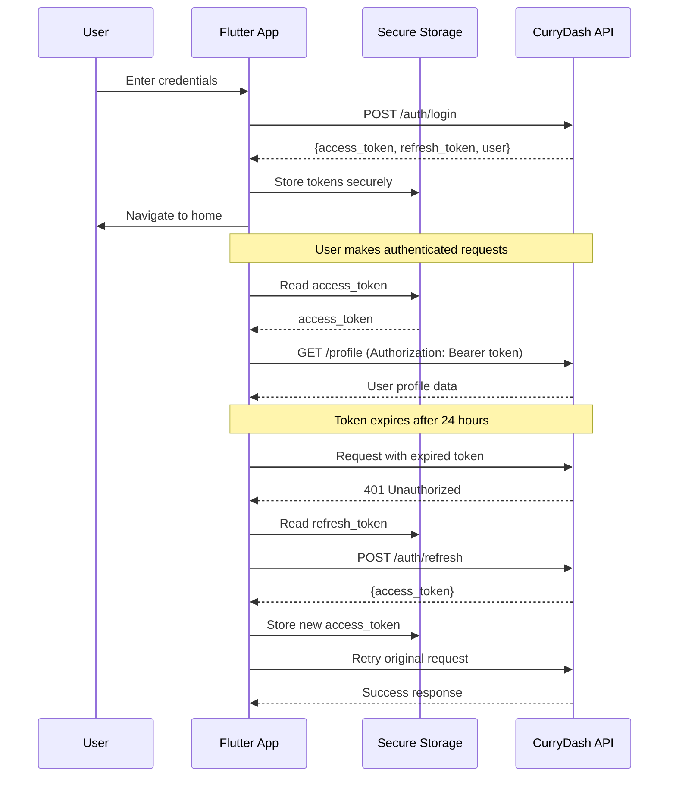

import { Callout, Steps, Tabs } from 'nextra/components'

# Authentication Integration Guide

This guide covers implementing secure JWT-based authentication in your Flutter application, including token storage, refresh flows, session management, and logout handling.

<Callout type="info">
  CurryDash uses JWT (JSON Web Tokens) for stateless authentication. Tokens expire after 24 hours and must be refreshed or the user must re-authenticate.
</Callout>

## Authentication Flow Overview



## 1. Secure Token Storage

<Callout type="warning">
  **Never** store authentication tokens in SharedPreferences or plain text files. Always use `flutter_secure_storage` for production apps.
</Callout>

### Setup Secure Storage

First, add the dependency to `pubspec.yaml`:

```yaml
dependencies:
  flutter_secure_storage: ^9.0.0
```

### Create Storage Service

Create a dedicated service for managing secure storage:

```dart
// lib/services/storage_service.dart
import 'package:flutter_secure_storage/flutter_secure_storage.dart';

class StorageService {
  static const _storage = FlutterSecureStorage(
    aOptions: AndroidOptions(
      encryptedSharedPreferences: true,
    ),
    iOptions: IOSOptions(
      accessibility: KeychainAccessibility.first_unlock,
    ),
  );

  // Storage keys
  static const String _accessTokenKey = 'access_token';
  static const String _refreshTokenKey = 'refresh_token';
  static const String _userDataKey = 'user_data';
  static const String _tokenExpiryKey = 'token_expiry';

  // Store authentication tokens
  Future<void> storeTokens({
    required String accessToken,
    required String refreshToken,
    required DateTime expiresAt,
  }) async {
    await Future.wait([
      _storage.write(key: _accessTokenKey, value: accessToken),
      _storage.write(key: _refreshTokenKey, value: refreshToken),
      _storage.write(key: _tokenExpiryKey, value: expiresAt.toIso8601String()),
    ]);
  }

  // Retrieve access token
  Future<String?> getAccessToken() async {
    return await _storage.read(key: _accessTokenKey);
  }

  // Retrieve refresh token
  Future<String?> getRefreshToken() async {
    return await _storage.read(key: _refreshTokenKey);
  }

  // Check if token is expired
  Future<bool> isTokenExpired() async {
    final expiryStr = await _storage.read(key: _tokenExpiryKey);
    if (expiryStr == null) return true;

    final expiryDate = DateTime.parse(expiryStr);
    return DateTime.now().isAfter(expiryDate);
  }

  // Store user data
  Future<void> storeUserData(Map<String, dynamic> userData) async {
    final userJson = jsonEncode(userData);
    await _storage.write(key: _userDataKey, value: userJson);
  }

  // Retrieve user data
  Future<Map<String, dynamic>?> getUserData() async {
    final userJson = await _storage.read(key: _userDataKey);
    if (userJson == null) return null;
    return jsonDecode(userJson) as Map<String, dynamic>;
  }

  // Clear all authentication data
  Future<void> clearAll() async {
    await Future.wait([
      _storage.delete(key: _accessTokenKey),
      _storage.delete(key: _refreshTokenKey),
      _storage.delete(key: _userDataKey),
      _storage.delete(key: _tokenExpiryKey),
    ]);
  }

  // Check if user is authenticated
  Future<bool> isAuthenticated() async {
    final token = await getAccessToken();
    return token != null && !await isTokenExpired();
  }
}
```

<Callout type="tip">
  **Token Expiry Calculation**: The API returns tokens with 24-hour validity. Calculate expiry time as `DateTime.now().add(Duration(hours: 24))` when storing tokens.
</Callout>

## 2. Login Implementation

### Authentication Service

Create a comprehensive authentication service:

```dart
// lib/services/auth_service.dart
import 'package:dio/dio.dart';
import 'dart:convert';
import 'storage_service.dart';
import 'api_client.dart';

class AuthService {
  final ApiClient _apiClient;
  final StorageService _storage;

  AuthService({
    required ApiClient apiClient,
    required StorageService storage,
  })  : _apiClient = apiClient,
        _storage = storage;

  /// Login user with email and password
  Future<AuthResult> login({
    required String email,
    required String password,
  }) async {
    try {
      final response = await _apiClient.client.post(
        '/auth/login',
        data: {
          'email': email,
          'password': password,
        },
      );

      if (response.data['success'] == true) {
        final data = response.data['data'];

        // Extract tokens and user data
        final accessToken = data['access_token'] as String;
        final refreshToken = data['refresh_token'] as String;
        final user = data['user'] as Map<String, dynamic>;

        // Calculate token expiry (24 hours from now)
        final expiresAt = DateTime.now().add(Duration(hours: 24));

        // Store tokens securely
        await _storage.storeTokens(
          accessToken: accessToken,
          refreshToken: refreshToken,
          expiresAt: expiresAt,
        );

        // Store user data
        await _storage.storeUserData(user);

        return AuthResult.success(user: user);
      } else {
        return AuthResult.failure(
          error: response.data['error']['message'] ?? 'Login failed',
        );
      }
    } on DioException catch (e) {
      return _handleAuthError(e);
    }
  }

  /// Register new user
  Future<AuthResult> register({
    required String name,
    required String email,
    required String password,
    required String phone,
  }) async {
    try {
      final response = await _apiClient.client.post(
        '/auth/register',
        data: {
          'name': name,
          'email': email,
          'password': password,
          'phone': phone,
        },
      );

      if (response.data['success'] == true) {
        final data = response.data['data'];
        final accessToken = data['access_token'] as String;
        final refreshToken = data['refresh_token'] as String;
        final user = data['user'] as Map<String, dynamic>;

        final expiresAt = DateTime.now().add(Duration(hours: 24));

        await _storage.storeTokens(
          accessToken: accessToken,
          refreshToken: refreshToken,
          expiresAt: expiresAt,
        );

        await _storage.storeUserData(user);

        return AuthResult.success(user: user);
      } else {
        return AuthResult.failure(
          error: response.data['error']['message'] ?? 'Registration failed',
        );
      }
    } on DioException catch (e) {
      return _handleAuthError(e);
    }
  }

  /// Check if user is currently authenticated
  Future<bool> isAuthenticated() async {
    return await _storage.isAuthenticated();
  }

  /// Get current user data from storage
  Future<Map<String, dynamic>?> getCurrentUser() async {
    return await _storage.getUserData();
  }

  /// Handle authentication errors
  AuthResult _handleAuthError(DioException error) {
    if (error.response != null) {
      final statusCode = error.response!.statusCode;
      final data = error.response!.data;

      // Handle validation errors (422)
      if (statusCode == 422 && data['error']?['errors'] != null) {
        return AuthResult.validationFailure(
          errors: Map<String, List<String>>.from(
            data['error']['errors'].map(
              (key, value) => MapEntry(
                key,
                List<String>.from(value),
              ),
            ),
          ),
        );
      }

      // Handle other API errors
      return AuthResult.failure(
        error: data['error']?['message'] ?? 'Authentication failed',
      );
    }

    // Handle network errors
    if (error.type == DioExceptionType.connectionTimeout ||
        error.type == DioExceptionType.receiveTimeout) {
      return AuthResult.failure(
        error: 'Connection timeout. Please check your internet connection.',
      );
    }

    return AuthResult.failure(
      error: 'Network error. Please try again.',
    );
  }
}

/// Authentication result wrapper
class AuthResult {
  final bool success;
  final Map<String, dynamic>? user;
  final String? error;
  final Map<String, List<String>>? validationErrors;

  AuthResult._({
    required this.success,
    this.user,
    this.error,
    this.validationErrors,
  });

  factory AuthResult.success({required Map<String, dynamic> user}) {
    return AuthResult._(success: true, user: user);
  }

  factory AuthResult.failure({required String error}) {
    return AuthResult._(success: false, error: error);
  }

  factory AuthResult.validationFailure({
    required Map<String, List<String>> errors,
  }) {
    return AuthResult._(
      success: false,
      validationErrors: errors,
      error: 'Validation failed',
    );
  }
}
```

### Login Screen Example

```dart
// lib/screens/login_screen.dart
import 'package:flutter/material.dart';
import '../services/auth_service.dart';

class LoginScreen extends StatefulWidget {
  @override
  State<LoginScreen> createState() => _LoginScreenState();
}

class _LoginScreenState extends State<LoginScreen> {
  final _formKey = GlobalKey<FormState>();
  final _emailController = TextEditingController();
  final _passwordController = TextEditingController();

  bool _isLoading = false;
  String? _errorMessage;
  Map<String, List<String>>? _validationErrors;

  final AuthService _authService = AuthService(
    apiClient: ApiClient(),
    storage: StorageService(),
  );

  Future<void> _handleLogin() async {
    if (!_formKey.currentState!.validate()) return;

    setState(() {
      _isLoading = true;
      _errorMessage = null;
      _validationErrors = null;
    });

    final result = await _authService.login(
      email: _emailController.text.trim(),
      password: _passwordController.text,
    );

    setState(() => _isLoading = false);

    if (result.success) {
      // Navigate to home screen
      Navigator.of(context).pushReplacementNamed('/home');
    } else {
      setState(() {
        _errorMessage = result.error;
        _validationErrors = result.validationErrors;
      });
    }
  }

  @override
  Widget build(BuildContext context) {
    return Scaffold(
      appBar: AppBar(title: Text('Login')),
      body: Padding(
        padding: EdgeInsets.all(16.0),
        child: Form(
          key: _formKey,
          child: Column(
            crossAxisAlignment: CrossAxisAlignment.stretch,
            children: [
              // Error message
              if (_errorMessage != null)
                Container(
                  padding: EdgeInsets.all(12),
                  margin: EdgeInsets.only(bottom: 16),
                  decoration: BoxDecoration(
                    color: Colors.red.shade100,
                    borderRadius: BorderRadius.circular(8),
                  ),
                  child: Text(
                    _errorMessage!,
                    style: TextStyle(color: Colors.red.shade900),
                  ),
                ),

              // Email field
              TextFormField(
                controller: _emailController,
                keyboardType: TextInputType.emailAddress,
                decoration: InputDecoration(
                  labelText: 'Email',
                  errorText: _validationErrors?['email']?.first,
                ),
                validator: (value) {
                  if (value == null || value.isEmpty) {
                    return 'Email is required';
                  }
                  return null;
                },
              ),
              SizedBox(height: 16),

              // Password field
              TextFormField(
                controller: _passwordController,
                obscureText: true,
                decoration: InputDecoration(
                  labelText: 'Password',
                  errorText: _validationErrors?['password']?.first,
                ),
                validator: (value) {
                  if (value == null || value.isEmpty) {
                    return 'Password is required';
                  }
                  return null;
                },
              ),
              SizedBox(height: 24),

              // Login button
              ElevatedButton(
                onPressed: _isLoading ? null : _handleLogin,
                child: _isLoading
                    ? SizedBox(
                        height: 20,
                        width: 20,
                        child: CircularProgressIndicator(strokeWidth: 2),
                      )
                    : Text('Login'),
              ),
            ],
          ),
        ),
      ),
    );
  }

  @override
  void dispose() {
    _emailController.dispose();
    _passwordController.dispose();
    super.dispose();
  }
}
```

## 3. Token Refresh Flow

<Callout type="warning">
  Implement automatic token refresh to provide seamless user experience. Refresh tokens before they expire, not after.
</Callout>

### Token Refresh Interceptor

Add token refresh logic to your API interceptor:

```dart
// lib/services/auth_interceptor.dart
import 'package:dio/dio.dart';
import 'storage_service.dart';

class AuthInterceptor extends QueuedInterceptor {
  final StorageService _storage;
  final Dio _dio;
  bool _isRefreshing = false;

  AuthInterceptor({
    required StorageService storage,
    required Dio dio,
  })  : _storage = storage,
        _dio = dio;

  @override
  void onRequest(
    RequestOptions options,
    RequestInterceptorHandler handler,
  ) async {
    // Skip auth header for login/register endpoints
    if (options.path.contains('/auth/login') ||
        options.path.contains('/auth/register')) {
      return handler.next(options);
    }

    // Get access token from storage
    final accessToken = await _storage.getAccessToken();

    if (accessToken != null) {
      // Check if token is about to expire (within 5 minutes)
      final isExpiringSoon = await _isTokenExpiringSoon();

      if (isExpiringSoon && !_isRefreshing) {
        // Refresh token proactively
        await _refreshToken();
        final newToken = await _storage.getAccessToken();
        options.headers['Authorization'] = 'Bearer $newToken';
      } else {
        options.headers['Authorization'] = 'Bearer $accessToken';
      }
    }

    handler.next(options);
  }

  @override
  void onError(
    DioException err,
    ErrorInterceptorHandler handler,
  ) async {
    // Handle 401 Unauthorized
    if (err.response?.statusCode == 401) {
      // Try to refresh token
      final refreshed = await _refreshToken();

      if (refreshed) {
        // Retry the original request with new token
        final accessToken = await _storage.getAccessToken();
        final requestOptions = err.requestOptions;
        requestOptions.headers['Authorization'] = 'Bearer $accessToken';

        try {
          final response = await _dio.fetch(requestOptions);
          return handler.resolve(response);
        } catch (e) {
          return handler.reject(err);
        }
      } else {
        // Refresh failed - clear storage and redirect to login
        await _storage.clearAll();
        // TODO: Navigate to login screen
        return handler.reject(err);
      }
    }

    handler.next(err);
  }

  /// Check if token is expiring within 5 minutes
  Future<bool> _isTokenExpiringSoon() async {
    final expiryStr = await _storage.read(key: 'token_expiry');
    if (expiryStr == null) return true;

    final expiryDate = DateTime.parse(expiryStr);
    final fiveMinutesFromNow = DateTime.now().add(Duration(minutes: 5));

    return expiryDate.isBefore(fiveMinutesFromNow);
  }

  /// Refresh access token using refresh token
  Future<bool> _refreshToken() async {
    if (_isRefreshing) return false;

    _isRefreshing = true;

    try {
      final refreshToken = await _storage.getRefreshToken();
      if (refreshToken == null) return false;

      final response = await _dio.post(
        '/auth/refresh',
        data: {'refresh_token': refreshToken},
      );

      if (response.data['success'] == true) {
        final newAccessToken = response.data['data']['access_token'] as String;
        final expiresAt = DateTime.now().add(Duration(hours: 24));

        await _storage.storeTokens(
          accessToken: newAccessToken,
          refreshToken: refreshToken, // Keep same refresh token
          expiresAt: expiresAt,
        );

        return true;
      }

      return false;
    } catch (e) {
      return false;
    } finally {
      _isRefreshing = false;
    }
  }
}
```

<Callout type="tip">
  **Proactive Refresh**: This interceptor checks if the token will expire within 5 minutes and refreshes it proactively before the request fails with 401.
</Callout>

## 4. Logout Implementation

### Logout Service Method

Add logout functionality to your auth service:

```dart
// Add to AuthService class

/// Logout user and clear all stored data
Future<void> logout() async {
  try {
    // Call logout endpoint (optional - invalidates token on server)
    final accessToken = await _storage.getAccessToken();

    if (accessToken != null) {
      await _apiClient.client.post(
        '/auth/logout',
        options: Options(
          headers: {'Authorization': 'Bearer $accessToken'},
        ),
      );
    }
  } catch (e) {
    // Continue with local logout even if API call fails
  } finally {
    // Always clear local storage
    await _storage.clearAll();
  }
}

/// Logout from all devices (invalidates refresh token)
Future<void> logoutAllDevices() async {
  try {
    await _apiClient.client.post('/auth/logout-all');
  } catch (e) {
    // Handle error
  } finally {
    await _storage.clearAll();
  }
}
```

### Logout Button Example

```dart
// In your profile or settings screen

ElevatedButton(
  onPressed: () async {
    // Show confirmation dialog
    final confirmed = await showDialog<bool>(
      context: context,
      builder: (context) => AlertDialog(
        title: Text('Logout'),
        content: Text('Are you sure you want to logout?'),
        actions: [
          TextButton(
            onPressed: () => Navigator.pop(context, false),
            child: Text('Cancel'),
          ),
          TextButton(
            onPressed: () => Navigator.pop(context, true),
            child: Text('Logout'),
          ),
        ],
      ),
    );

    if (confirmed == true) {
      await _authService.logout();

      // Navigate to login screen and clear navigation stack
      Navigator.of(context).pushNamedAndRemoveUntil(
        '/login',
        (route) => false,
      );
    }
  },
  child: Text('Logout'),
)
```

## 5. Session Management

### App Initialization Check

Check authentication status on app startup:

```dart
// lib/main.dart
import 'package:flutter/material.dart';
import 'services/auth_service.dart';
import 'screens/login_screen.dart';
import 'screens/home_screen.dart';

void main() {
  runApp(MyApp());
}

class MyApp extends StatelessWidget {
  @override
  Widget build(BuildContext context) {
    return MaterialApp(
      title: 'CurryDash',
      home: SplashScreen(),
      routes: {
        '/login': (context) => LoginScreen(),
        '/home': (context) => HomeScreen(),
      },
    );
  }
}

class SplashScreen extends StatefulWidget {
  @override
  State<SplashScreen> createState() => _SplashScreenState();
}

class _SplashScreenState extends State<SplashScreen> {
  final AuthService _authService = AuthService(
    apiClient: ApiClient(),
    storage: StorageService(),
  );

  @override
  void initState() {
    super.initState();
    _checkAuthStatus();
  }

  Future<void> _checkAuthStatus() async {
    // Add small delay for splash screen
    await Future.delayed(Duration(seconds: 2));

    final isAuthenticated = await _authService.isAuthenticated();

    if (mounted) {
      if (isAuthenticated) {
        Navigator.of(context).pushReplacementNamed('/home');
      } else {
        Navigator.of(context).pushReplacementNamed('/login');
      }
    }
  }

  @override
  Widget build(BuildContext context) {
    return Scaffold(
      body: Center(
        child: CircularProgressIndicator(),
      ),
    );
  }
}
```

### Session Timeout Handling

Implement automatic logout on session timeout:

```dart
// lib/services/session_manager.dart
import 'dart:async';
import 'package:flutter/material.dart';
import 'storage_service.dart';

class SessionManager {
  static const Duration _inactivityTimeout = Duration(minutes: 30);
  Timer? _inactivityTimer;
  final StorageService _storage;
  final VoidCallback onSessionExpired;

  SessionManager({
    required StorageService storage,
    required this.onSessionExpired,
  }) : _storage = storage;

  /// Start monitoring user activity
  void startMonitoring() {
    _resetTimer();
  }

  /// Stop monitoring (call on logout)
  void stopMonitoring() {
    _inactivityTimer?.cancel();
  }

  /// Call this method on any user interaction
  void recordActivity() {
    _resetTimer();
  }

  void _resetTimer() {
    _inactivityTimer?.cancel();
    _inactivityTimer = Timer(_inactivityTimeout, _handleTimeout);
  }

  Future<void> _handleTimeout() async {
    // Clear session data
    await _storage.clearAll();

    // Notify app to redirect to login
    onSessionExpired();
  }
}

// Usage in your app:
//
// final sessionManager = SessionManager(
//   storage: StorageService(),
//   onSessionExpired: () {
//     Navigator.of(context).pushNamedAndRemoveUntil(
//       '/login',
//       (route) => false,
//     );
//   },
// );
//
// // In your main widget, wrap with GestureDetector:
// GestureDetector(
//   onTap: () => sessionManager.recordActivity(),
//   onPanDown: (_) => sessionManager.recordActivity(),
//   behavior: HitTestBehavior.translucent,
//   child: YourApp(),
// )
```

## 6. Complete API Client with Auth

Here's the complete API client setup with authentication:

```dart
// lib/services/api_client.dart
import 'package:dio/dio.dart';
import 'auth_interceptor.dart';
import 'storage_service.dart';

class ApiClient {
  static const String baseUrl = 'https://api.currydash.com/v1';

  late final Dio _dio;
  final StorageService _storage = StorageService();

  ApiClient() {
    _dio = Dio(
      BaseOptions(
        baseUrl: baseUrl,
        connectTimeout: Duration(seconds: 30),
        receiveTimeout: Duration(seconds: 30),
        headers: {
          'Content-Type': 'application/json',
          'Accept': 'application/json',
        },
      ),
    );

    // Add auth interceptor
    _dio.interceptors.add(
      AuthInterceptor(
        storage: _storage,
        dio: _dio,
      ),
    );

    // Add logging in debug mode
    _dio.interceptors.add(
      LogInterceptor(
        requestBody: true,
        responseBody: true,
        error: true,
      ),
    );
  }

  Dio get client => _dio;
}
```

## 7. Best Practices

<Callout type="tip">
  Follow these security best practices for production applications:
</Callout>

### Security Checklist

- ✅ **Use HTTPS only** - Never send tokens over HTTP in production
- ✅ **Secure storage** - Always use `flutter_secure_storage` for tokens
- ✅ **Token expiry** - Implement automatic refresh before expiration
- ✅ **Logout everywhere** - Provide option to invalidate all sessions
- ✅ **Clear on logout** - Always clear all stored data on logout
- ✅ **Session timeout** - Implement inactivity-based session expiration
- ✅ **Error handling** - Never expose tokens in error logs
- ✅ **Certificate pinning** - Consider SSL pinning for high-security apps

### Common Pitfalls to Avoid

| ❌ Don't | ✅ Do |
|---------|-------|
| Store tokens in SharedPreferences | Use flutter_secure_storage |
| Ignore token expiration | Implement proactive refresh |
| Make auth requests without HTTPS | Always use HTTPS in production |
| Log tokens in error messages | Sanitize logs before sending to analytics |
| Keep user logged in forever | Implement session timeout |
| Ignore 401 errors | Handle and refresh/re-authenticate |

## 8. Testing Authentication

### Unit Test Example

```dart
// test/services/auth_service_test.dart
import 'package:flutter_test/flutter_test.dart';
import 'package:mockito/mockito.dart';
import 'package:dio/dio.dart';

void main() {
  group('AuthService', () {
    late AuthService authService;
    late MockApiClient mockApiClient;
    late MockStorageService mockStorage;

    setUp(() {
      mockApiClient = MockApiClient();
      mockStorage = MockStorageService();
      authService = AuthService(
        apiClient: mockApiClient,
        storage: mockStorage,
      );
    });

    test('login success stores tokens and user data', () async {
      // Arrange
      final mockResponse = {
        'success': true,
        'data': {
          'access_token': 'test_access_token',
          'refresh_token': 'test_refresh_token',
          'user': {'id': 1, 'email': 'test@example.com'},
        },
      };

      when(mockApiClient.client.post(any, data: anyNamed('data')))
          .thenAnswer((_) async => Response(
                data: mockResponse,
                statusCode: 200,
                requestOptions: RequestOptions(path: ''),
              ));

      // Act
      final result = await authService.login(
        email: 'test@example.com',
        password: 'password',
      );

      // Assert
      expect(result.success, true);
      verify(mockStorage.storeTokens(
        accessToken: 'test_access_token',
        refreshToken: 'test_refresh_token',
        expiresAt: any,
      )).called(1);
      verify(mockStorage.storeUserData(any)).called(1);
    });

    test('login failure returns error message', () async {
      // Arrange
      when(mockApiClient.client.post(any, data: anyNamed('data')))
          .thenThrow(DioException(
            requestOptions: RequestOptions(path: ''),
            response: Response(
              data: {
                'success': false,
                'error': {'message': 'Invalid credentials'},
              },
              statusCode: 401,
              requestOptions: RequestOptions(path: ''),
            ),
          ));

      // Act
      final result = await authService.login(
        email: 'test@example.com',
        password: 'wrong_password',
      );

      // Assert
      expect(result.success, false);
      expect(result.error, 'Invalid credentials');
    });
  });
}
```

## Next Steps

Now that you have authentication set up, explore these related topics:

- [API Integration Overview](/api/frontend/getting-started) - Complete integration guide
- [Error Handling](/api/frontend/error-handling) - Advanced error handling patterns
- [State Management](/developers/frontend/state-management) - Integrate auth with state management
- [API Reference](/api/backend) - Complete endpoint documentation

## Support

For authentication-related issues:

1. Check token storage using Flutter DevTools
2. Enable Dio logging to debug requests
3. Verify token format and expiry
4. Contact api-support@currydash.com for backend issues
