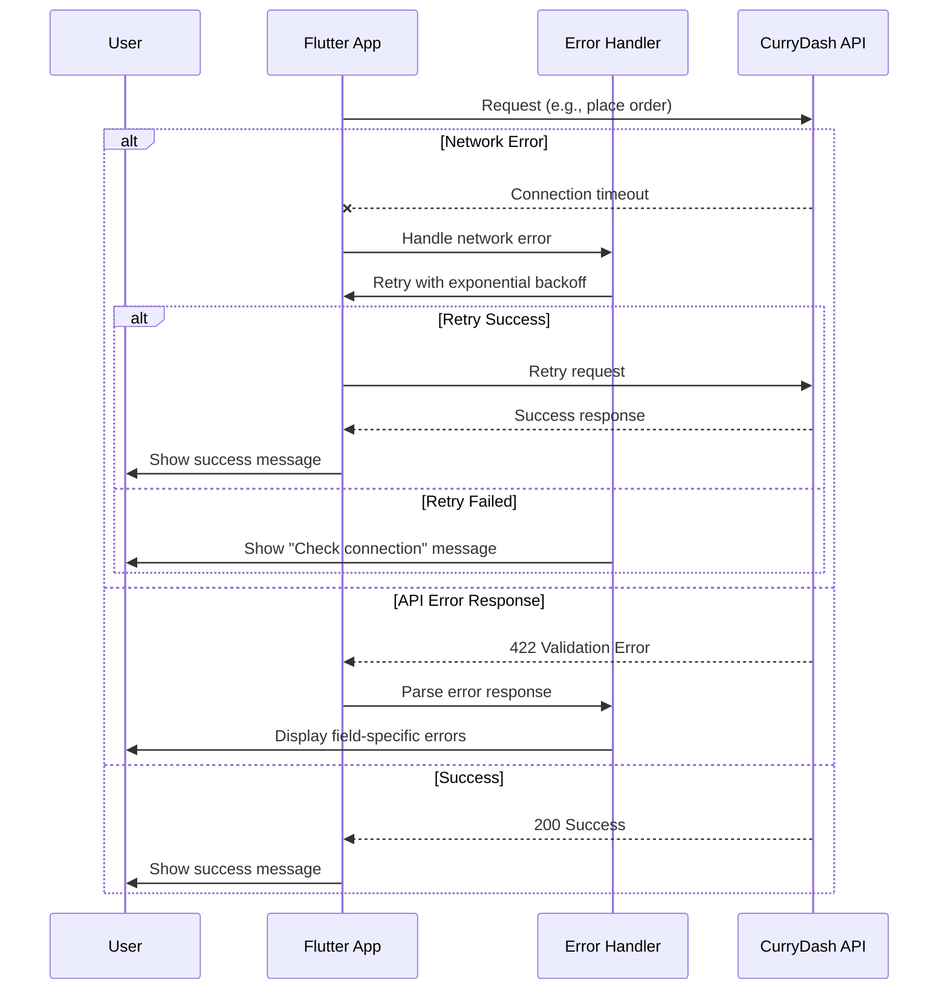

import { Callout, Steps, Tabs } from 'nextra/components'

# Error Handling Guide

This guide covers comprehensive error handling strategies for your Flutter application, including API error codes, network failure handling, retry mechanisms, and user-friendly error display patterns.

<Callout type="warning">
  Proper error handling is critical for production apps. Never expose raw API errors to users - always translate them into user-friendly messages.
</Callout>

## Error Handling Flow Overview



## 1. Error Code Reference

### Authentication Errors (401, 403)

| Error Code | Description | User Action | Developer Action |
|------------|-------------|-------------|------------------|
| **auth-001** | Invalid credentials | "Email or password is incorrect" | Verify input fields |
| **auth-002** | Token expired | Auto-refresh token | Implement token refresh interceptor |
| **auth-003** | Insufficient permissions | "You don't have permission" | Check user role/guards |

### Validation Errors (422)

| Error Code | Description | User Action | Developer Action |
|------------|-------------|-------------|------------------|
| **validation-001** | Required field missing | Highlight required field | Check form validation |
| **validation-002** | Invalid format | "Please enter valid email" | Add input formatters |
| **package-001** | Min choices not met | "Select at least X items" | Validate selections before submit |
| **package-002** | Max choices exceeded | "Maximum X items allowed" | Disable selection UI when max reached |

### Order Errors (400, 402)

| Error Code | Description | User Action | Developer Action |
|------------|-------------|-------------|------------------|
| **order-001** | Cart empty | "Add items to cart first" | Check cart state before checkout |
| **order-002** | Minimum order not met | "Minimum order is $25" | Display minimum order requirement |
| **order-003** | Restaurant closed | "Restaurant is currently closed" | Check restaurant open status |
| **payment-001** | Payment failed | "Payment unsuccessful. Try again" | Retry with different method |

### Zone/Service Errors (404)

| Error Code | Description | User Action | Developer Action |
|------------|-------------|-------------|------------------|
| **zone-001** | Service unavailable | "We don't deliver to this area yet" | Show zone coverage map |

### Rate Limiting (429)

| Error Code | Description | User Action | Developer Action |
|------------|-------------|-------------|------------------|
| **rate-limit-001** | Too many requests | "Too many attempts. Wait \{seconds\}s" | Implement exponential backoff |

## 2. Error Response Models

### Create Error Models

Define strongly-typed error models for type safety:

```dart
// lib/models/api_error.dart
class ApiError {
  final String code;
  final String message;
  final String? field;

  ApiError({
    required this.code,
    required this.message,
    this.field,
  });

  factory ApiError.fromJson(Map<String, dynamic> json) {
    return ApiError(
      code: json['code'] as String,
      message: json['message'] as String,
      field: json['field'] as String?,
    );
  }

  @override
  String toString() => 'ApiError($code: $message)';
}

class ApiErrorResponse {
  final List<ApiError> errors;
  final int statusCode;

  ApiErrorResponse({
    required this.errors,
    required this.statusCode,
  });

  factory ApiErrorResponse.fromJson(Map<String, dynamic> json, int statusCode) {
    final errorsList = json['errors'] as List<dynamic>? ?? [];
    return ApiErrorResponse(
      errors: errorsList.map((e) => ApiError.fromJson(e as Map<String, dynamic>)).toList(),
      statusCode: statusCode,
    );
  }

  String get primaryMessage => errors.isNotEmpty ? errors.first.message : 'An error occurred';

  Map<String, String> get fieldErrors {
    return {
      for (var error in errors)
        if (error.field != null) error.field!: error.message
    };
  }

  bool hasFieldError(String field) {
    return errors.any((e) => e.field == field);
  }

  String? getFieldError(String field) {
    return errors.firstWhere((e) => e.field == field, orElse: () => ApiError(code: '', message: '')).message;
  }
}
```

### Exception Hierarchy

Create custom exceptions for different error types:

```dart
// lib/exceptions/api_exceptions.dart
abstract class AppException implements Exception {
  final String message;
  final String? code;

  AppException(this.message, {this.code});

  @override
  String toString() => message;
}

class NetworkException extends AppException {
  NetworkException([String? message])
      : super(message ?? 'Unable to connect. Check your internet connection.');
}

class TimeoutException extends AppException {
  TimeoutException([String? message])
      : super(message ?? 'Request timed out. Please try again.');
}

class ServerException extends AppException {
  final int statusCode;

  ServerException(this.statusCode, String message) : super(message);
}

class ValidationException extends AppException {
  final Map<String, String> fieldErrors;

  ValidationException(String message, this.fieldErrors) : super(message);
}

class AuthenticationException extends AppException {
  AuthenticationException([String? message])
      : super(message ?? 'Authentication failed. Please login again.');
}

class UnauthorizedException extends AppException {
  UnauthorizedException([String? message])
      : super(message ?? 'You don\'t have permission to perform this action.');
}
```

## 3. Network Error Handling

### HTTP Client with Error Handling

Implement a centralized HTTP client with comprehensive error handling:

```dart
// lib/services/api_client.dart
import 'package:http/http.dart' as http;
import 'dart:async';
import 'dart:convert';
import 'dart:io';

class ApiClient {
  final String baseUrl = 'https://currydash.au/api/v1';
  final StorageService _storage;
  final Duration timeout = const Duration(seconds: 30);

  ApiClient(this._storage);

  Future<http.Response> get(String endpoint, {Map<String, String>? headers}) async {
    return _makeRequest(
      () => http.get(
        Uri.parse('$baseUrl$endpoint'),
        headers: await _buildHeaders(headers),
      ),
    );
  }

  Future<http.Response> post(String endpoint, {Map<String, dynamic>? body, Map<String, String>? headers}) async {
    return _makeRequest(
      () => http.post(
        Uri.parse('$baseUrl$endpoint'),
        headers: await _buildHeaders(headers),
        body: json.encode(body),
      ),
    );
  }

  Future<http.Response> put(String endpoint, {Map<String, dynamic>? body, Map<String, String>? headers}) async {
    return _makeRequest(
      () => http.put(
        Uri.parse('$baseUrl$endpoint'),
        headers: await _buildHeaders(headers),
        body: json.encode(body),
      ),
    );
  }

  Future<http.Response> delete(String endpoint, {Map<String, String>? headers}) async {
    return _makeRequest(
      () => http.delete(
        Uri.parse('$baseUrl$endpoint'),
        headers: await _buildHeaders(headers),
      ),
    );
  }

  Future<Map<String, String>> _buildHeaders(Map<String, String>? customHeaders) async {
    final headers = {
      'Content-Type': 'application/json',
      'Accept': 'application/json',
    };

    // Add auth token if available
    final token = await _storage.getAccessToken();
    if (token != null) {
      headers['Authorization'] = 'Bearer $token';
    }

    if (customHeaders != null) {
      headers.addAll(customHeaders);
    }

    return headers;
  }

  Future<http.Response> _makeRequest(Future<http.Response> Function() request) async {
    try {
      final response = await request().timeout(timeout);
      return _handleResponse(response);
    } on SocketException {
      throw NetworkException('No internet connection. Please check your network settings.');
    } on TimeoutException {
      throw TimeoutException('Request timed out. Please check your connection and try again.');
    } on HttpException {
      throw NetworkException('Unable to connect to server.');
    } catch (e) {
      throw NetworkException('An unexpected error occurred: ${e.toString()}');
    }
  }

  http.Response _handleResponse(http.Response response) {
    switch (response.statusCode) {
      case 200:
      case 201:
        return response;

      case 400:
        final errorResponse = ApiErrorResponse.fromJson(
          json.decode(response.body) as Map<String, dynamic>,
          response.statusCode,
        );
        throw ServerException(400, errorResponse.primaryMessage);

      case 401:
        final errorResponse = ApiErrorResponse.fromJson(
          json.decode(response.body) as Map<String, dynamic>,
          response.statusCode,
        );

        // Check if token expired
        final isTokenExpired = errorResponse.errors.any((e) => e.code == 'auth-002');
        if (isTokenExpired) {
          // Token refresh will be handled by interceptor
          throw AuthenticationException('Session expired. Please login again.');
        }
        throw AuthenticationException(errorResponse.primaryMessage);

      case 403:
        throw UnauthorizedException();

      case 404:
        final errorResponse = ApiErrorResponse.fromJson(
          json.decode(response.body) as Map<String, dynamic>,
          response.statusCode,
        );
        throw ServerException(404, errorResponse.primaryMessage);

      case 422:
        final errorResponse = ApiErrorResponse.fromJson(
          json.decode(response.body) as Map<String, dynamic>,
          response.statusCode,
        );
        throw ValidationException(
          errorResponse.primaryMessage,
          errorResponse.fieldErrors,
        );

      case 429:
        final errorResponse = ApiErrorResponse.fromJson(
          json.decode(response.body) as Map<String, dynamic>,
          response.statusCode,
        );
        final retryAfter = errorResponse.errors.firstWhere(
          (e) => e.code == 'rate-limit-001',
          orElse: () => ApiError(code: '', message: 'Too many requests'),
        ).message;
        throw ServerException(429, retryAfter);

      case 500:
      case 502:
      case 503:
        throw ServerException(
          response.statusCode,
          'Server error. Please try again later.',
        );

      default:
        throw ServerException(
          response.statusCode,
          'Unexpected error occurred (${response.statusCode})',
        );
    }
  }
}
```

## 4. Retry Logic with Exponential Backoff

### Retry Interceptor

Implement smart retry logic for transient failures:

```dart
// lib/services/retry_interceptor.dart
class RetryConfig {
  final int maxRetries;
  final Duration initialDelay;
  final double multiplier;
  final Duration maxDelay;
  final List<int> retryableStatusCodes;

  const RetryConfig({
    this.maxRetries = 3,
    this.initialDelay = const Duration(seconds: 1),
    this.multiplier = 2.0,
    this.maxDelay = const Duration(seconds: 10),
    this.retryableStatusCodes = const [408, 429, 500, 502, 503, 504],
  });
}

class RetryInterceptor {
  final RetryConfig config;

  RetryInterceptor({RetryConfig? config}) : config = config ?? const RetryConfig();

  Future<T> execute<T>(Future<T> Function() request) async {
    int attempt = 0;
    Duration delay = config.initialDelay;

    while (true) {
      try {
        return await request();
      } catch (e) {
        attempt++;

        // Check if error is retryable
        if (!_isRetryable(e) || attempt >= config.maxRetries) {
          rethrow;
        }

        // Log retry attempt
        print('Retry attempt $attempt/${config.maxRetries} after ${delay.inSeconds}s delay');

        // Wait before retrying
        await Future.delayed(delay);

        // Calculate next delay with exponential backoff
        delay = Duration(
          milliseconds: (delay.inMilliseconds * config.multiplier).round(),
        );

        // Cap at max delay
        if (delay > config.maxDelay) {
          delay = config.maxDelay;
        }
      }
    }
  }

  bool _isRetryable(dynamic error) {
    if (error is NetworkException || error is TimeoutException) {
      return true;
    }

    if (error is ServerException) {
      return config.retryableStatusCodes.contains(error.statusCode);
    }

    return false;
  }
}
```

### Usage Example

```dart
// Example: Placing an order with retry logic
class OrderRepository {
  final ApiClient _apiClient;
  final RetryInterceptor _retryInterceptor;

  OrderRepository(this._apiClient) : _retryInterceptor = RetryInterceptor();

  Future<Order> placeOrder(OrderRequest orderRequest) async {
    return await _retryInterceptor.execute(() async {
      final response = await _apiClient.post(
        '/orders',
        body: orderRequest.toJson(),
      );

      final data = json.decode(response.body) as Map<String, dynamic>;
      return Order.fromJson(data);
    });
  }
}
```

## 5. Validation Error Display

### Form Field Error Display

Display validation errors directly on form fields:

```dart
// lib/widgets/validated_text_field.dart
import 'package:flutter/material.dart';

class ValidatedTextField extends StatelessWidget {
  final String label;
  final String? errorText;
  final TextEditingController controller;
  final TextInputType? keyboardType;
  final bool obscureText;
  final String? Function(String?)? validator;

  const ValidatedTextField({
    Key? key,
    required this.label,
    required this.controller,
    this.errorText,
    this.keyboardType,
    this.obscureText = false,
    this.validator,
  }) : super(key: key);

  @override
  Widget build(BuildContext context) {
    return TextFormField(
      controller: controller,
      keyboardType: keyboardType,
      obscureText: obscureText,
      validator: validator,
      decoration: InputDecoration(
        labelText: label,
        errorText: errorText,
        errorMaxLines: 2,
        border: OutlineInputBorder(
          borderRadius: BorderRadius.circular(8),
        ),
        focusedBorder: OutlineInputBorder(
          borderRadius: BorderRadius.circular(8),
          borderSide: BorderSide(
            color: errorText != null ? Colors.red : Theme.of(context).primaryColor,
            width: 2,
          ),
        ),
        errorBorder: OutlineInputBorder(
          borderRadius: BorderRadius.circular(8),
          borderSide: const BorderSide(color: Colors.red, width: 1),
        ),
      ),
    );
  }
}
```

### State Management for Errors

Use a state management approach to handle field errors:

```dart
// lib/providers/form_error_provider.dart
import 'package:flutter/foundation.dart';

class FormErrorProvider with ChangeNotifier {
  Map<String, String> _fieldErrors = {};

  Map<String, String> get fieldErrors => _fieldErrors;

  void setFieldErrors(Map<String, String> errors) {
    _fieldErrors = errors;
    notifyListeners();
  }

  void setFieldError(String field, String message) {
    _fieldErrors[field] = message;
    notifyListeners();
  }

  void clearFieldError(String field) {
    _fieldErrors.remove(field);
    notifyListeners();
  }

  void clearAllErrors() {
    _fieldErrors.clear();
    notifyListeners();
  }

  String? getFieldError(String field) {
    return _fieldErrors[field];
  }

  bool hasFieldError(String field) {
    return _fieldErrors.containsKey(field);
  }
}
```

### Login Form Example

Complete example with error handling:

```dart
// lib/screens/login_screen.dart
import 'package:flutter/material.dart';
import 'package:provider/provider.dart';

class LoginScreen extends StatefulWidget {
  @override
  _LoginScreenState createState() => _LoginScreenState();
}

class _LoginScreenState extends State<LoginScreen> {
  final _formKey = GlobalKey<FormState>();
  final _emailController = TextEditingController();
  final _passwordController = TextEditingController();
  bool _isLoading = false;

  @override
  Widget build(BuildContext context) {
    return Scaffold(
      appBar: AppBar(title: Text('Login')),
      body: Consumer<FormErrorProvider>(
        builder: (context, errorProvider, child) {
          return Padding(
            padding: EdgeInsets.all(16),
            child: Form(
              key: _formKey,
              child: Column(
                children: [
                  ValidatedTextField(
                    label: 'Email',
                    controller: _emailController,
                    keyboardType: TextInputType.emailAddress,
                    errorText: errorProvider.getFieldError('email_or_phone'),
                    validator: (value) {
                      if (value?.isEmpty ?? true) {
                        return 'Email is required';
                      }
                      return null;
                    },
                  ),
                  SizedBox(height: 16),
                  ValidatedTextField(
                    label: 'Password',
                    controller: _passwordController,
                    obscureText: true,
                    errorText: errorProvider.getFieldError('password'),
                    validator: (value) {
                      if (value?.isEmpty ?? true) {
                        return 'Password is required';
                      }
                      return null;
                    },
                  ),
                  SizedBox(height: 24),
                  ElevatedButton(
                    onPressed: _isLoading ? null : _handleLogin,
                    child: _isLoading
                        ? CircularProgressIndicator(color: Colors.white)
                        : Text('Login'),
                  ),
                ],
              ),
            ),
          );
        },
      ),
    );
  }

  Future<void> _handleLogin() async {
    final errorProvider = Provider.of<FormErrorProvider>(context, listen: false);
    errorProvider.clearAllErrors();

    if (!_formKey.currentState!.validate()) {
      return;
    }

    setState(() => _isLoading = true);

    try {
      final authService = Provider.of<AuthService>(context, listen: false);
      await authService.login(
        emailOrPhone: _emailController.text,
        password: _passwordController.text,
      );

      // Navigate to home on success
      Navigator.pushReplacementNamed(context, '/home');

    } on ValidationException catch (e) {
      errorProvider.setFieldErrors(e.fieldErrors);
      _showErrorSnackbar(e.message);

    } on AuthenticationException catch (e) {
      _showErrorSnackbar(e.message);

    } on NetworkException catch (e) {
      _showErrorSnackbar(e.message);

    } catch (e) {
      _showErrorSnackbar('An unexpected error occurred. Please try again.');

    } finally {
      setState(() => _isLoading = false);
    }
  }

  void _showErrorSnackbar(String message) {
    ScaffoldMessenger.of(context).showSnackBar(
      SnackBar(
        content: Text(message),
        backgroundColor: Colors.red,
        behavior: SnackBarBehavior.floating,
      ),
    );
  }

  @override
  void dispose() {
    _emailController.dispose();
    _passwordController.dispose();
    super.dispose();
  }
}
```

## 6. User-Friendly Error Messages

### Error Message Translation

Create a service to translate error codes to user-friendly messages:

```dart
// lib/services/error_message_service.dart
class ErrorMessageService {
  static String getUserMessage(String errorCode) {
    switch (errorCode) {
      // Authentication
      case 'auth-001':
        return 'The email or password you entered is incorrect. Please try again.';
      case 'auth-002':
        return 'Your session has expired. Please login again.';
      case 'auth-003':
        return 'You don\'t have permission to perform this action.';

      // Validation
      case 'validation-001':
        return 'Please fill in all required fields.';
      case 'validation-002':
        return 'Please check the information you entered and try again.';

      // Package
      case 'package-001':
        return 'Please select the minimum required number of items.';
      case 'package-002':
        return 'You\'ve selected too many items. Please remove some.';

      // Order
      case 'order-001':
        return 'Your cart is empty. Please add items before placing an order.';
      case 'order-002':
        return 'The order total doesn\'t meet the minimum requirement.';
      case 'order-003':
        return 'This restaurant is currently closed. Please try again during opening hours.';

      // Payment
      case 'payment-001':
        return 'Payment failed. Please check your payment details and try again.';

      // Zone
      case 'zone-001':
        return 'We don\'t deliver to this area yet. Please try a different address.';

      // Rate limit
      case 'rate-limit-001':
        return 'Too many attempts. Please wait a moment and try again.';

      default:
        return 'Something went wrong. Please try again.';
    }
  }

  static IconData getErrorIcon(String errorCode) {
    if (errorCode.startsWith('auth-')) {
      return Icons.lock_outline;
    } else if (errorCode.startsWith('payment-')) {
      return Icons.payment_outlined;
    } else if (errorCode.startsWith('zone-')) {
      return Icons.location_off_outlined;
    } else if (errorCode.startsWith('order-')) {
      return Icons.shopping_cart_outlined;
    } else {
      return Icons.error_outline;
    }
  }
}
```

### Error Dialog Component

Create a reusable error dialog:

```dart
// lib/widgets/error_dialog.dart
import 'package:flutter/material.dart';

class ErrorDialog extends StatelessWidget {
  final String title;
  final String message;
  final String? errorCode;
  final VoidCallback? onRetry;

  const ErrorDialog({
    Key? key,
    this.title = 'Error',
    required this.message,
    this.errorCode,
    this.onRetry,
  }) : super(key: key);

  @override
  Widget build(BuildContext context) {
    return AlertDialog(
      icon: Icon(
        errorCode != null
            ? ErrorMessageService.getErrorIcon(errorCode!)
            : Icons.error_outline,
        color: Colors.red,
        size: 48,
      ),
      title: Text(title),
      content: Column(
        mainAxisSize: MainAxisSize.min,
        children: [
          Text(message),
          if (errorCode != null) ...[
            SizedBox(height: 8),
            Text(
              'Error code: $errorCode',
              style: TextStyle(
                fontSize: 12,
                color: Colors.grey,
              ),
            ),
          ],
        ],
      ),
      actions: [
        if (onRetry != null)
          TextButton(
            onPressed: () {
              Navigator.of(context).pop();
              onRetry!();
            },
            child: Text('Retry'),
          ),
        TextButton(
          onPressed: () => Navigator.of(context).pop(),
          child: Text('OK'),
        ),
      ],
    );
  }

  static void show(
    BuildContext context, {
    String title = 'Error',
    required String message,
    String? errorCode,
    VoidCallback? onRetry,
  }) {
    showDialog(
      context: context,
      builder: (context) => ErrorDialog(
        title: title,
        message: message,
        errorCode: errorCode,
        onRetry: onRetry,
      ),
    );
  }
}
```

## 7. Global Error Handler

### Error Boundary Widget

Create a global error boundary for catching unhandled errors:

```dart
// lib/widgets/error_boundary.dart
import 'package:flutter/material.dart';

class ErrorBoundary extends StatefulWidget {
  final Widget child;
  final Widget Function(FlutterErrorDetails)? errorBuilder;

  const ErrorBoundary({
    Key? key,
    required this.child,
    this.errorBuilder,
  }) : super(key: key);

  @override
  _ErrorBoundaryState createState() => _ErrorBoundaryState();
}

class _ErrorBoundaryState extends State<ErrorBoundary> {
  FlutterErrorDetails? _error;

  @override
  void initState() {
    super.initState();

    // Capture Flutter framework errors
    FlutterError.onError = (FlutterErrorDetails details) {
      setState(() {
        _error = details;
      });

      // Log to error tracking service (e.g., Sentry)
      // Sentry.captureException(details.exception, stackTrace: details.stack);
    };
  }

  @override
  Widget build(BuildContext context) {
    if (_error != null) {
      return widget.errorBuilder?.call(_error!) ?? _buildDefaultErrorWidget();
    }

    return widget.child;
  }

  Widget _buildDefaultErrorWidget() {
    return Scaffold(
      body: Center(
        child: Padding(
          padding: EdgeInsets.all(24),
          child: Column(
            mainAxisAlignment: MainAxisAlignment.center,
            children: [
              Icon(Icons.error_outline, size: 64, color: Colors.red),
              SizedBox(height: 16),
              Text(
                'Something went wrong',
                style: TextStyle(fontSize: 24, fontWeight: FontWeight.bold),
              ),
              SizedBox(height: 8),
              Text(
                'We\'re working to fix this issue. Please restart the app.',
                textAlign: TextAlign.center,
                style: TextStyle(color: Colors.grey),
              ),
              SizedBox(height: 24),
              ElevatedButton(
                onPressed: () {
                  setState(() {
                    _error = null;
                  });
                },
                child: Text('Try Again'),
              ),
            ],
          ),
        ),
      ),
    );
  }
}
```

## 8. Best Practices

<Callout type="info">
  Follow these best practices for robust error handling in production apps.
</Callout>

### DO's ✅

1. **Always translate error codes to user-friendly messages**
   ```dart
   // Good
   throw AuthenticationException('The email or password is incorrect');

   // Bad
   throw Exception('auth-001');
   ```

2. **Provide actionable error messages**
   ```dart
   // Good
   'Unable to connect. Please check your internet connection and try again.'

   // Bad
   'Network error'
   ```

3. **Log errors for debugging**
   ```dart
   try {
     await apiCall();
   } catch (e, stackTrace) {
     debugPrint('Error: $e');
     debugPrint('StackTrace: $stackTrace');
     // Send to error tracking service
     rethrow;
   }
   ```

4. **Use specific exception types**
   ```dart
   // Good
   if (e is ValidationException) {
     // Show field errors
   } else if (e is NetworkException) {
     // Show retry button
   }
   ```

5. **Implement retry for transient failures**
   ```dart
   // Retry network errors and 5xx server errors
   if (error is NetworkException || statusCode >= 500) {
     await retryWithBackoff();
   }
   ```

### DON'Ts ❌

1. **Never expose raw error messages to users**
   ```dart
   // Bad
   ScaffoldMessenger.showSnackBar(
     SnackBar(content: Text(e.toString()))
   );
   ```

2. **Don't swallow errors silently**
   ```dart
   // Bad
   try {
     await apiCall();
   } catch (e) {
     // Silent failure - user has no idea what happened
   }
   ```

3. **Don't retry indefinitely**
   ```dart
   // Bad - infinite loop
   while (true) {
     try {
       return await apiCall();
     } catch (e) {
       await Future.delayed(Duration(seconds: 1));
     }
   }
   ```

4. **Don't ignore status codes**
   ```dart
   // Bad
   final response = await http.get(url);
   return json.decode(response.body); // Might fail on 4xx/5xx
   ```

## 9. Testing Error Scenarios

### Unit Tests for Error Handling

```dart
// test/services/api_client_test.dart
import 'package:flutter_test/flutter_test.dart';
import 'package:mockito/mockito.dart';

void main() {
  group('ApiClient Error Handling', () {
    test('should throw NetworkException on SocketException', () async {
      // Arrange
      final mockClient = MockHttpClient();
      when(mockClient.get(any)).thenThrow(SocketException('No internet'));

      // Act & Assert
      expect(
        () => apiClient.get('/test'),
        throwsA(isA<NetworkException>()),
      );
    });

    test('should throw ValidationException on 422 status', () async {
      // Arrange
      final mockResponse = http.Response(
        '{"errors": [{"code": "validation-001", "message": "Invalid email", "field": "email"}]}',
        422,
      );

      // Act & Assert
      expect(
        () => apiClient.handleResponse(mockResponse),
        throwsA(isA<ValidationException>()),
      );
    });

    test('should retry on network failure', () async {
      // Arrange
      var attempts = 0;
      Future<String> flakeyRequest() async {
        attempts++;
        if (attempts < 3) {
          throw NetworkException();
        }
        return 'success';
      }

      // Act
      final result = await retryInterceptor.execute(flakeyRequest);

      // Assert
      expect(result, 'success');
      expect(attempts, 3);
    });
  });
}
```

## Summary

Effective error handling requires:

1. **Structured error models** - Type-safe error handling with custom exceptions
2. **Network resilience** - Timeout handling, retry logic, exponential backoff
3. **User-friendly messages** - Translate error codes to actionable messages
4. **Field-level validation** - Display errors next to relevant form fields
5. **Global error boundary** - Catch and handle unhandled exceptions
6. **Comprehensive testing** - Test error scenarios in unit and integration tests

<Callout type="tip">
  For production apps, integrate with error tracking services like Sentry or Firebase Crashlytics to monitor and debug errors in real-time.
</Callout>

## Related Documentation

- [Authentication Integration Guide](./authentication) - Token refresh error handling
- [Backend API Specification](/developers/backend/architecture/api-specification) - Complete error code reference
- [Getting Started](./getting-started) - API client setup

---

**Last Updated**: 2026-01-22 (Documentation migration & modernization)
**Maintainer**: CurryDash Documentation Team
