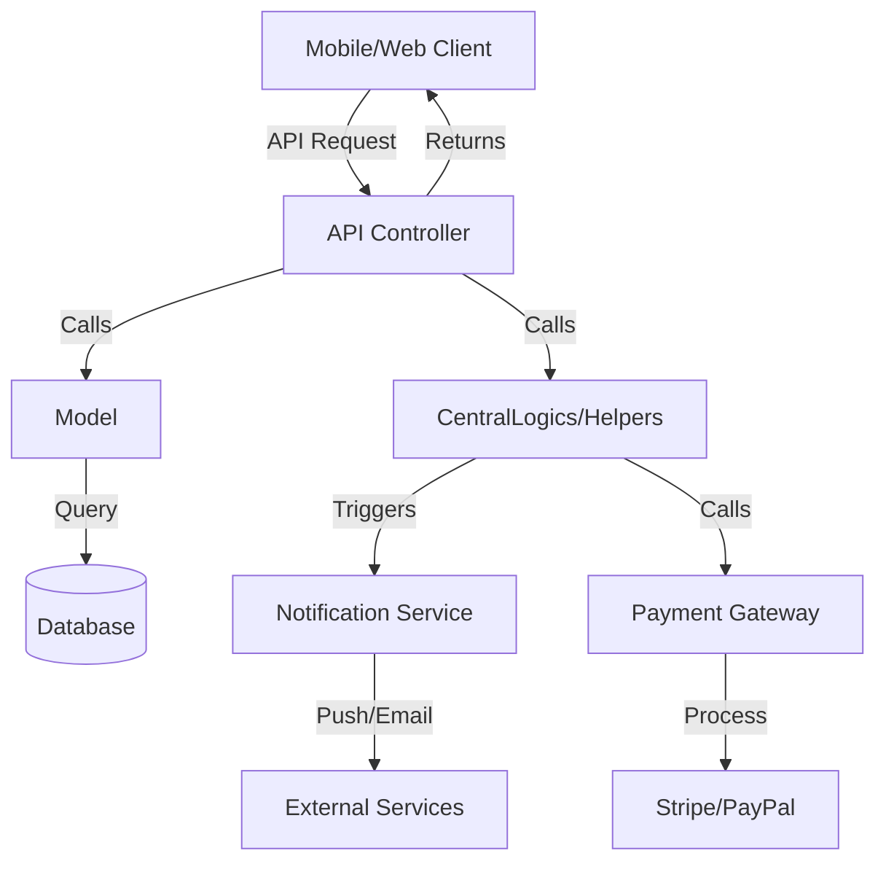

# CentralLogics Orchestration Layer (CUR)

## Purpose

The **CentralLogics** directory (`app/CentralLogics/`) serves as the **Central orchestration layer** for the CurryDash platform. It contains:

- Cross-project utility functions
- Business logic shared between CAD, CAR, PACK, CCW, CPFP
- Payment processing helpers
- Notification triggers
- Settings management

**Jira Project**: CUR (CurryPackApp Central Management)

## Key Files

### `Helpers.php`

**Purpose**: Static utility methods used throughout the application

**Key Methods**:

| Method | Purpose | Used By |
|--------|---------|---------|
| `error_processor($validator)` | Format validation errors for API | All controllers |
| `schedule_order()` | Check if scheduled orders enabled | Order controllers |
| `variation_price($product, $variations)` | Calculate variation price | Cart, Order |
| `get_full_url($type, $filename, $storage)` | Generate full image URL | Models (Package, Food, Restaurant) |
| `send_push_notif_to_device($fcm_token, $data)` | Send push notification | Order status changes |
| `send_push_notif_to_topic($data, $topic)` | Broadcast to topic | Admin announcements |

**Example Usage**:
```php
use App\CentralLogics\Helpers;

// In Controller
if ($validator->fails()) {
    return response()->json([
        'errors' => Helpers::error_processor($validator)
    ], 403);
}

// In Model Accessor
public function getImageFullUrlAttribute()
{
    return Helpers::get_full_url('package', $this->image, 'public');
}
```

### `OrderLogic.php`

**Purpose**: Order lifecycle orchestration

**Responsibilities**:
- Order creation workflow
- Order status transitions
- Payment processing coordination
- Notification triggers (customer, vendor, delivery)
- Order assignment to delivery personnel

### `RestaurantLogic.php`

**Purpose**: Restaurant/vendor business logic

**Responsibilities**:
- Vendor registration approval
- Restaurant availability calculation
- Zone/delivery area validation
- Vendor analytics aggregation

## CUR Orchestration Patterns



**See**: [Cross-Project Integration](./cross-project-integration) for detailed integration patterns

---
