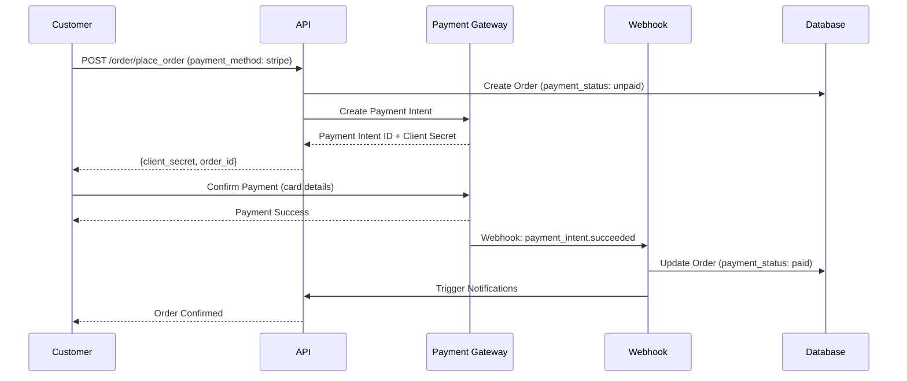

# Payment Gateway Integration

## Supported Gateways (12+)

CurryDash supports **12+ payment gateways** for global coverage:

**Controllers** (`app/Http/Controllers/`):
```
Payment Gateways:
├── StripePaymentController.php (USA, Europe, Australia)
├── RazorPayController.php (India)
├── PayPalPaymentController.php (Global)
├── SslCommerzPaymentController.php (Bangladesh)
├── PaytmController.php (India)
├── PaystackController.php (Nigeria, Africa)
├── FutterwaveV3Controller.php (Africa)
├── MercadoPagoController.php (Latin America)
├── BkashPaymentController.php (Bangladesh mobile money)
├── PaymobController.php (Middle East)
├── LiqPayController.php (Ukraine)
├── SenangPayController.php (Malaysia)
└── WalletPaymentController.php (In-app wallet)
```

## Payment Gateway Trait

**Location**: `app/Traits/PaymentGatewayTrait.php` (600+ lines)

```php
trait PaymentGatewayTrait
{
    /**
     * Make payment via specified gateway
     */
    private function make_payment($gateway, $amount, $order_id)
    {
        switch ($gateway) {
            case 'stripe':
                return $this->stripe_payment($amount, $order_id);
            case 'paypal':
                return $this->paypal_payment($amount, $order_id);
            case 'razorpay':
                return $this->razorpay_payment($amount, $order_id);
            // ... 12+ gateways
        }
    }

    /**
     * Verify payment after redirect
     */
    private function verify_payment($gateway, $transaction_id)
    {
        switch ($gateway) {
            case 'stripe':
                return Stripe::verifyPaymentIntent($transaction_id);
            case 'paypal':
                return PayPal::captureOrder($transaction_id);
            // ...
        }
    }

    /**
     * Handle webhook notifications
     */
    private function handle_webhook($gateway, $payload)
    {
        switch ($gateway) {
            case 'stripe':
                $event = Stripe::constructWebhookEvent($payload);
                if ($event->type === 'payment_intent.succeeded') {
                    $this->mark_order_paid($event->data->object->id);
                }
                break;
            // ...
        }
    }

    /**
     * Process refund
     */
    private function refund_payment($gateway, $transaction_id, $amount)
    {
        switch ($gateway) {
            case 'stripe':
                return Stripe::refunds()->create([
                    'payment_intent' => $transaction_id,
                    'amount' => $amount * 100, // cents
                ]);
            // ...
        }
    }
}
```

## Payment Flow



## Payment Methods in Order Schema

```php
// Order model
payment_method enum:
├── 'cash_on_delivery' - Pay on delivery
├── 'digital_payment' - Gateway-based (stripe, paypal, etc.)
├── 'wallet' - In-app wallet balance
└── 'offline_payment' - Bank transfer, manual payment (admin approval)

payment_status enum:
├── 'unpaid' - Awaiting payment
├── 'paid' - Payment confirmed
├── 'failed' - Payment failed/declined
└── 'refunded' - Payment refunded
```

---
